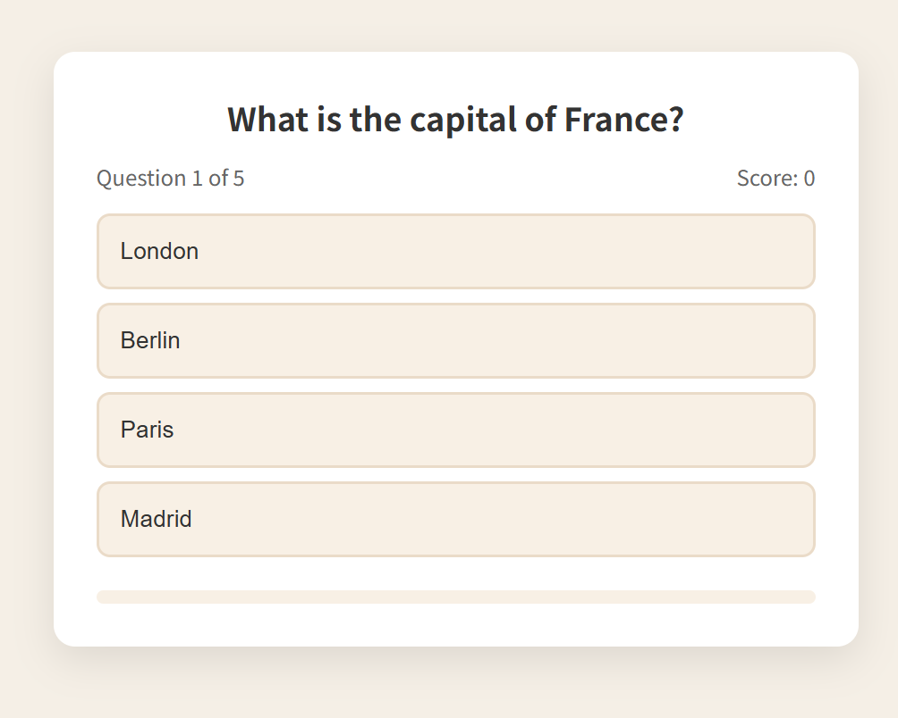
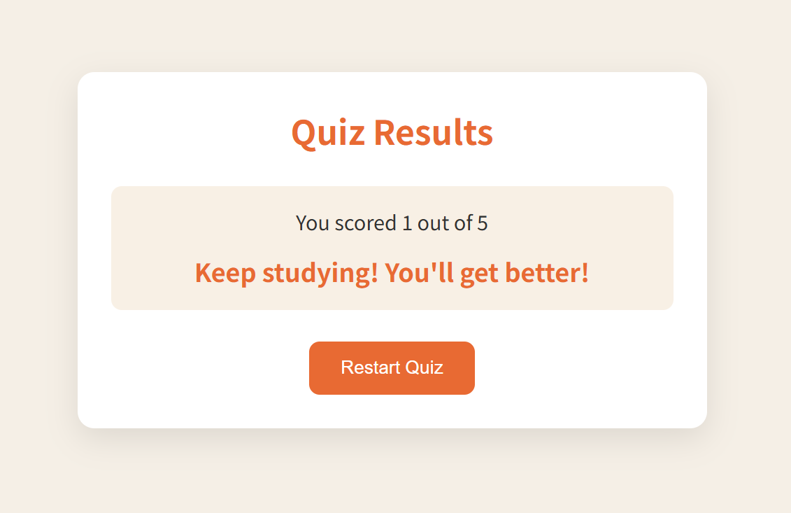

## html+css+js开发

#### 开发设置：

1、visual studio；

2、vs上安装live server插件；实时查看网页效果；

3、源文件：index.html, style.css, script.js;

4、一般的开发流程：index.html->style.css->script.js

5、参考开发手册：[面向开发者的 Web 技术 | MDN](https://developer.mozilla.org/zh-CN/docs/Web)


#### 项目4：






与项目1不同，该项目要在三个页面之间切换，如何做到？具体思路如下：

html的设置：

```html
<div class="container">
  <!-- 开始页 -->
  <div class="screen active" id="start-screen">...</div>
  
  <!-- 题目页 -->
  <div class="screen" id="quiz-screen">...</div>
  
  <!-- 结果页 -->
  <div class="screen" id="result-screen">...</div>
</div>
```

css的设置：

```css
.screen {
  display: none; /* 默认隐藏所有屏幕 */
}
.screen.active {
  display: block; /* 只显示有active类的屏幕 */
}
```

js的设置：

```js
//开始页->题目页；
function startQuiz() {
  // 重置变量
  currentQuestionIndex = 0;
  score = 0;
  // 切换屏幕
  startScreen.classList.remove("active");
  quizScreen.classList.add("active");
  // 显示第一个问题
  showQuestion();
}
//题目页->结果页；
function showResults() {
  // 切换屏幕
  quizScreen.classList.remove("active");
  resultScreen.classList.add("active");
  // 显示分数
  finalScoreSpan.textContent = score;
}
//结果页->开始页;
function restartQuiz() {
  // 返回开始页
  resultScreen.classList.remove("active");
  startScreen.classList.add("active"); // 实际代码中是通过startQuiz()间接实现
}
```


#### js内容：

1、获取html组件：

```js
// DOM Elements
const startScreen = document.getElementById("start-screen");
const quizScreen = document.getElementById("quiz-screen");
const resultScreen = document.getElementById("result-screen");
const startButton = document.getElementById("start-btn");
const questionText = document.getElementById("question-text");
const answersContainer = document.getElementById("answers-container");
const currentQuestionSpan = document.getElementById("current-question");
const totalQuestionsSpan = document.getElementById("total-questions");
const scoreSpan = document.getElementById("score");
const finalScoreSpan = document.getElementById("final-score");
const maxScoreSpan = document.getElementById("max-score");
const resultMessage = document.getElementById("result-message");
const restartButton = document.getElementById("restart-btn");
const progressBar = document.getElementById("progress");
```

下面是题目的数组：

```js
const quizQuestions = [
  {
    question: "What is the capital of France?",
    answers: [
      { text: "London", correct: false },
      { text: "Berlin", correct: false },
      { text: "Paris", correct: true },
      { text: "Madrid", correct: false },
    ],
  },
  {
    question: "Which planet is known as the Red Planet?",
    answers: [
      { text: "Venus", correct: false },
      { text: "Mars", correct: true },
      { text: "Jupiter", correct: false },
      { text: "Saturn", correct: false },
    ],
  },
  {
    question: "What is the largest ocean on Earth?",
    answers: [
      { text: "Atlantic Ocean", correct: false },
      { text: "Indian Ocean", correct: false },
      { text: "Arctic Ocean", correct: false },
      { text: "Pacific Ocean", correct: true },
    ],
  },
  {
    question: "Which of these is NOT a programming language?",
    answers: [
      { text: "Java", correct: false },
      { text: "Python", correct: false },
      { text: "Banana", correct: true },
      { text: "JavaScript", correct: false },
    ],
  },
  {
    question: "What is the chemical symbol for gold?",
    answers: [
      { text: "Go", correct: false },
      { text: "Gd", correct: false },
      { text: "Au", correct: true },
      { text: "Ag", correct: false },
    ],
  },
];
```

状态变量：

```js
// QUIZ STATE VARS
let currentQuestionIndex = 0;
let score = 0;
let answersDisabled = false;

totalQuestionsSpan.textContent = quizQuestions.length;
maxScoreSpan.textContent = quizQuestions.length;
```

从起始页切换到题目页：

```js
// event listeners
startButton.addEventListener("click", startQuiz);

function startQuiz() {
  // reset vars
  currentQuestionIndex = 0;
  score = 0;
  scoreSpan.textContent = 0;

  startScreen.classList.remove("active");
  quizScreen.classList.add("active");

  showQuestion();
}

function showQuestion() {
  // reset state
  answersDisabled = false;
  const currentQuestion = quizQuestions[currentQuestionIndex];
  currentQuestionSpan.textContent = currentQuestionIndex + 1;
  
  const progressPercent = (currentQuestionIndex / quizQuestions.length) * 100;
  progressBar.style.width = progressPercent + "%";
  questionText.textContent = currentQuestion.question;
  answersContainer.innerHTML = "";

  currentQuestion.answers.forEach((answer) => {
    const button = document.createElement("button");
    button.textContent = answer.text;
    button.classList.add("answer-btn");

    // what is dataset? it's a property of the button element that allows you to store custom data
    button.dataset.correct = answer.correct;
    button.addEventListener("click", selectAnswer);
    answersContainer.appendChild(button);
  });
}

//上述代码对应的html代码：
//<div class="answers-container">
//  <button class="answer-btn" data-correct="true/false">Answer Text 1</button>
//  <button class="answer-btn" data-correct="true/false">Answer Text 2</button>
//  <button class="answer-btn" data-correct="true/false">Answer Text 3</button>
//  <button class="answer-btn" data-correct="true/false">Answer Text 4</button>
//</div>

function selectAnswer(event) {
  // optimization check
  if (answersDisabled) return;
  answersDisabled = true;

  const selectedButton = event.target;
  const isCorrect = selectedButton.dataset.correct === "true";
  // Here Array.from() is used to convert the NodeList returned by answersContainer.children into an array, this is because the NodeList is not an array and we need to use the forEach method
  Array.from(answersContainer.children).forEach((button) => {
    if (button.dataset.correct === "true") {
      button.classList.add("correct");
    } else if (button === selectedButton) {
      button.classList.add("incorrect");
    }
  });

  if (isCorrect) {
    score++;
    scoreSpan.textContent = score;
  }

  setTimeout(() => {
    currentQuestionIndex++;
    // check if there are more questions or if the quiz is over
    if (currentQuestionIndex < quizQuestions.length) {
      showQuestion();
    } else {
      showResults();
    }
  }, 1000);
}

function showResults() {
  quizScreen.classList.remove("active");
  resultScreen.classList.add("active");

  finalScoreSpan.textContent = score;

  const percentage = (score / quizQuestions.length) * 100;

  if (percentage === 100) {
    resultMessage.textContent = "Perfect! You're a genius!";
  } else if (percentage >= 80) {
    resultMessage.textContent = "Great job! You know your stuff!";
  } else if (percentage >= 60) {
    resultMessage.textContent = "Good effort! Keep learning!";
  } else if (percentage >= 40) {
    resultMessage.textContent = "Not bad! Try again to improve!";
  } else {
    resultMessage.textContent = "Keep studying! You'll get better!";
  }
}
```

从题目页到结果页：

```js
restartButton.addEventListener("click", restartQuiz);

function restartQuiz() {
  resultScreen.classList.remove("active");
  startQuiz();
}
```


