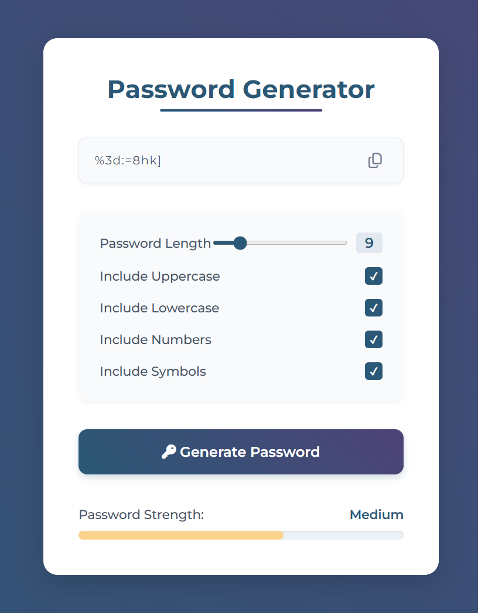

## html+css+js开发

#### 开发设置：

1、visual studio；

2、vs上安装live server插件；实时查看网页效果；

3、源文件：index.html, style.css, script.js;

4、一般的开发流程：index.html->style.css->script.js

5、参考开发手册：[面向开发者的 Web 技术 | MDN](https://developer.mozilla.org/zh-CN/docs/Web)


#### 项目2：密码生成器

最终效果图：



使用的html组件：

```hmtl
<div>, <h1>, <option>, <input>, <checkbox>,<button>
```

第三方组件库：[font-awesome - Libraries - cdnjs - The #1 free and open source CDN built to make life easier for developers](https://cdnjs.com/libraries/font-awesome)

```html
#复制引入到html文件中；
<link rel="stylesheet" href="https://cdnjs.cloudflare.com/ajax/libs/font-awesome/6.7.2/css/all.min.css" integrity="sha512-Evv84Mr4kqVGRNSgIGL/F/aIDqQb7xQ2vcrdIwxfjThSH8CSR7PBEakCr51Ck+w+/U6swU2Im1vVX0SVk9ABhg==" crossorigin="anonymous" referrerpolicy="no-referrer" />
```

**css属性：css伪元素：**

伪元素是CSS中的一个特殊概念，它允许你为元素的**特定部分**设置样式，而无需在HTML中添加额外的标记。伪元素使用双冒号语法 `::`（CSS3规范，但单冒号 `:` 也兼容），它们代表元素的某个特定部分。

常见的伪元素：

1. **`::before`** - 在元素内容**前**插入内容
2. **`::after`** - 在元素内容**后**插入内容

为什么使用伪元素？**装饰性元素**：比如下划线效果，无需污染HTML结构。

在我们的密码生成器中，`::after` 被用来创建那个漂亮的渐变下划线，这是伪元素的典型用法之一——添加纯粹的装饰性元素而不影响HTML结构。

js的总体逻辑：

```js
1、获取各个input的值；
2、根据input的值生成密码，并显示；
3、根据密码，计算password的强度，并设置strength bar；
4、点击按钮事件，复制密码；
```

获取各个input值的代码：

```js
const passwordInput = document.getElementById("password");
const lengthSlider = document.getElementById("length");
const lengthDisplay = document.getElementById("length-value");
const uppercaseCheckbox = document.getElementById("uppercase");
const lowercaseCheckbox = document.getElementById("lowercase");
const numbersCheckbox = document.getElementById("numbers");
const symbolsCheckbox = document.getElementById("symbols");
const generateButton = document.getElementById("generate-btn");
const copyButton = document.getElementById("copy-btn");
const strengthBar = document.querySelector(".strength-bar");
const strengthText = document.querySelector(".strength-container p");
const strengthLabel = document.getElementById("strength-label");
```

生成密码的流程：

```js
//所使用到的字符；
const uppercaseLetters = "ABCDEFGHIJKLMNOPQRSTUVWXYZ";
const lowercaseLetters = "abcdefghijklmnopqrstuvwxyz";
const numberCharacters = "0123456789";
const symbolCharacters = "!@#$%^&*()-_=+[]{}|;:,.<>?/";

lengthSlider.addEventListener("input", () => {
  lengthDisplay.textContent = lengthSlider.value;
});

// 给按钮添加事件；
generateButton.addEventListener("click", makePassword);

function makePassword() {
  const length = Number(lengthSlider.value);
  const includeUppercase = uppercaseCheckbox.checked;
  const includeLowercase = lowercaseCheckbox.checked;
  const includeNumbers = numbersCheckbox.checked;
  const includeSymbols = symbolsCheckbox.checked;
 //一定要勾选一种字符类型；
 if (!includeUppercase && !includeLowercase && !includeNumbers && !includeSymbols) {
    alert("Please select at least one char type.");
    return;
  }
  //生成密码；
  const newPassword = createRandomPassword(
    length,
    includeUppercase,
    includeLowercase,
    includeNumbers,
    includeSymbols
  );
  passwordInput.value = newPassword;
  //更新密码强度指示条；
  updateStrengthMeter(newPassword);
}

//生成密码；
function createRandomPassword(
  length,
  includeUppercase,
  includeLowercase,
  includeNumbers,
  includeSymbols
) {
  let allCharacters = "";
  // "ABCDEFGHIJKLMNOPQRSTUVWXYZ"

  if (includeUppercase) allCharacters += uppercaseLetters;
  if (includeLowercase) allCharacters += lowercaseLetters;
  if (includeNumbers) allCharacters += numberCharacters;
  if (includeSymbols) allCharacters += symbolCharacters;

  let password = "";

  for (let i = 0; i < length; i++) {
    const randomIndex = Math.floor(Math.random() * allCharacters.length);
    password += allCharacters[randomIndex];
  }
  return password;
}
```

更新密码指示条的过程：

```js
function updateStrengthMeter(password) {
  const passwordLength = password.length;
  
  const hasUppercase = /[A-Z]/.test(password);
  const hasLowercase = /[a-z]/.test(password);
  const hasNumbers = /[0-9]/.test(password);
  const hasSymbols = /[!@#$%^&*()-_=+[\]{}|;:,.<>?]/.test(password);

  let strengthScore = 0;
  // here the .min will get the minimum value
  // but this will make sure that "at maximum" you would get 40
  strengthScore += Math.min(passwordLength * 2, 40);

  if (hasUppercase) strengthScore += 15;
  if (hasLowercase) strengthScore += 15;
  if (hasNumbers) strengthScore += 15;
  if (hasSymbols) strengthScore += 15;

  // enforce minimum score for every short password
  if (passwordLength < 8) {
    strengthScore = Math.min(strengthScore, 40);
  }

  // ensure the width of the strength bar is a valid percentage
  const safeScore = Math.max(5, Math.min(100, strengthScore));
  strengthBar.style.width = safeScore + "%";

  let strengthLabelText = "";
  let barColor = "";

  if (strengthScore < 40) {
    // weak password
    barColor = "#fc8181";
    strengthLabelText = "Weak";
  } else if (strengthScore < 70) {
    // Medium password
    barColor = "#fbd38d"; // Yellow
    strengthLabelText = "Medium";
  } else {
    // Strong password
    barColor = "#68d391"; // Green
    strengthLabelText = "Strong";
  }

  strengthBar.style.backgroundColor = barColor;
  strengthLabel.textContent = strengthLabelText;
}
```

在浏览器加载初始页面时，生成一个密码初始值：

```js
window.addEventListener("DOMContentLoaded", makePassword);
```

点击复制按钮，复制粘贴密码的流程：

```js
copyButton.addEventListener("click", () => {
  if (!passwordInput.value) return;

  navigator.clipboard
    .writeText(passwordInput.value)
    .then(() => showCopySuccess())
    .catch((error) => console.log("Could not copy:", error));
});

function showCopySuccess() {
  copyButton.classList.remove("far", "fa-copy");
  copyButton.classList.add("fas", "fa-check");
  copyButton.style.color = "#48bb78";

  setTimeout(() => {
    copyButton.classList.remove("fas", "fa-check");
    copyButton.classList.add("far", "fa-copy");
    copyButton.style.color = "";
  }, 1500);
}
```


