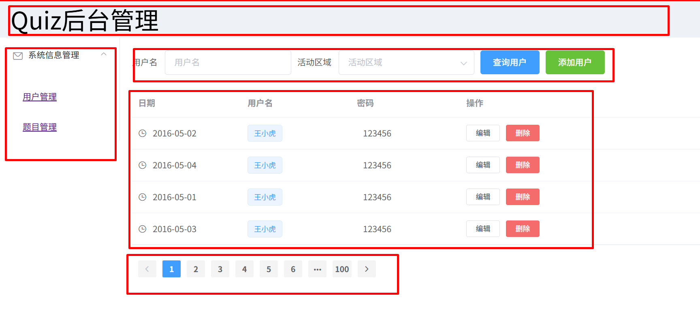
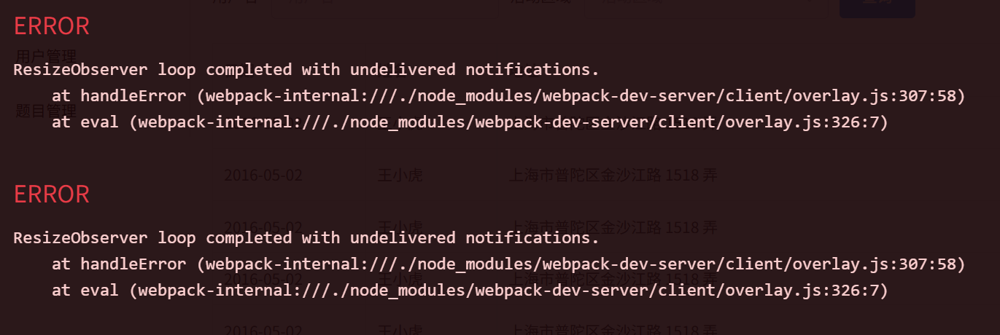

## Vue前端工程化及基于组件的开发

##### 参考资料：

1、Vue2官网：[安装 — Vue.js](https://v2.cn.vuejs.org/v2/guide/installation.html)

2、B站黑马程序员[Day03-04. 前端工程化-环境准备_哔哩哔哩_bilibili](https://www.bilibili.com/video/BV1m84y1w7Tb?spm_id_from=333.788.videopod.episodes&vd_source=b0e6d0da66db457c6afda440766d8139&p=37)


##### 1、什么是Vue前端工程化？

提供如下能力的Vue前端开发环境：

- 统一的目录结构；
- 本地调试；
- 热部署；
- 单元测试；
- 集成打包上线；

Vue-cli是Vue官方提供的一个脚手架，可以快速生成一个具备上述能力的Vue项目模板。

Vue-cli运行的环境：Node.js；


##### 2、如何安装Node.js？

先安装Node.js的版本管理器：nvm.exe；

**为什么不直接安装node.js，而要通过nvm来安装？**

安装完毕NVM.exe后，再实用nvm.exe来安装指定版本的node.js：

```js
//比如：安装16.19.1版本的node.js
nvm install 16.19.1
//安装完成后，显示当前电脑中已经安装的不同版本的node.js：
nvm list
//指定当前环境中，使用16.19.1版本的node.js
nvm use 16.19.1
```

在命令行环境下，测试当前的node.js环境：

```cmd
//查看当前node.js的版本：
node -v
//查看npm的版本；
npm -v
```

npm是node.js安装包的命令，类似于ubuntu中的apt。

为了加快node.js安装包的速度，将其使用的安装包的源地址，配置为国内的淘宝，命令如下：

```js
npm config set registry https://registry.npm.taobao.org
```


##### 3、安装Vue-cli脚手架

```js
//安装命令;安装vue
npm install -g @vue/cli
```

确定是否安装成功：

```js
vue --version
```

如果能看到版本号，就说明脚手架安装成功。

##### 4、创建Vue项目

命令行：vue create vue-project

图形化界面：vue ui

使用图形界面创建一个新的Vue项目；

Vue初始项目文件介绍；

如何运行Vue项目；

```js
npm run serve
```

vs code中安装Vue的插件：vetur

App.vue组件文件：

```vue
<template>
  <div>
     {{message}}
  </div>
</template>

<script>
    export default{
        data(){
            return{
                message:"hello vue"
            }
        },
        methods:{
            
        }
    }
</script>

<style>
    .h{
        color:red;
    }
</style>
```


##### 5、Element组件库

一套组件库，组件是组成网页的部件，比如超链接，按钮，图片，表格等。

[Element - 网站快速成型工具](https://element.eleme.cn/#/zh-CN)

使用element的好处：快速使用一些效果还不错的组件。

黑马对应视频：[Day03-07. Element-快速入门_哔哩哔哩_bilibili](https://www.bilibili.com/video/BV1m84y1w7Tb?spm_id_from=333.788.player.switch&vd_source=b0e6d0da66db457c6afda440766d8139&p=40)


**Element快速入门案例：**

步骤1：安装ElementUI组件库；

```js
npm install element-ui@2.15.14
```

步骤2：引入ElementUI组件库：

```js
//下列代码添加到main.js中；
import ElementUI from 'element-ui';
import 'element-ui/lib/theme-chalk/index.css';

Vue.use(ElementUI);
```

步骤3：访问官网，复制组件代码并调整；

```js
//比如复制按钮组件；
//https://element.eleme.cn/#/zh-CN/component/button
<el-row>
  <el-button>默认按钮</el-button>
  <el-button type="primary">主要按钮</el-button>
  <el-button type="success">成功按钮</el-button>
  <el-button type="info">信息按钮</el-button>
  <el-button type="warning">警告按钮</el-button>
  <el-button type="danger">危险按钮</el-button>
</el-row>
```

将上述的代码写在：/views/element/ElementView.vue中：

```vue
<template>
<div>
    <el-row>
        <el-button>默认按钮</el-button>
        <el-button type="primary">主要按钮</el-button>
        <el-button type="success">成功按钮</el-button>
        <el-button type="info">信息按钮</el-button>
        <el-button type="warning">警告按钮</el-button>
        <el-button type="danger">危险按钮</el-button>
    </el-row>
</div>
</template>

<script>
export default{

}
</script>

<style>
</style>
```

在App.vue中引入ElementView组件：

```vue
<template>
  <div>
     <h1>{{message}}</h1>
      //引入elementview组件；
     <element-view>
     </element-view>
  </div>
</template>

<script>
    //import element view组件;
    import ElementView from './views/element/ElementView.vue'
    export default{
        components: { ElementView },
        data(){
            return{
                message:"hello vue"
            }
        },
        methods:{
            
        }
    }
</script>

<style>
    h1{
      color:red;
    }
</style>
```


##### 6、Element常见组件

**table组件：**

[组件 | Element](https://element.eleme.cn/#/zh-CN/component/table)

注意复制过程中的自动格式化快捷键：

```js
1、在windows环境下,ctrl+s调出快捷命令查询框；
2、查找format document命令的快捷键：shift + alt + F
```

**分页组件：**

[组件 | Element](https://element.eleme.cn/#/zh-CN/component/pagination)

**对话框组件：**

[组件 | Element](https://element.eleme.cn/#/zh-CN/component/dialog)

**Form组件:**

[组件 | Element](https://element.eleme.cn/#/zh-CN/component/form)


##### 7、Element案例

**Element布局组件：**

[组件 | Element](https://element.eleme.cn/#/zh-CN/component/container)

**步骤1：**

找到需要的页面布局container，找到目标布局，并复制代码：

```vue
<el-container>
  <el-header>Header</el-header>
  <el-container>
    <el-aside width="200px">Aside</el-aside>
    <el-main>Main</el-main>
  </el-container>
</el-container>
```



**header的设置：**

对于header，只需要设置下背景颜色，及字体大小即可，具体的代码如下：

```html
<el-header style="font-size: 40px; background-color: rgb(238, 241, 246)">Quiz后台管理</el-header>
```

**侧边导航栏的设置：**

[组件 | Element](https://element.eleme.cn/#/zh-CN/component/container)

采用案例中的菜单栏，再进行调整。

**main区域设置：**

- 顶部form表单；主要同时复制js部分代码；

  [组件 | Element](https://element.eleme.cn/#/zh-CN/component/form)

- 带编辑/删除操作选项的table项目；

  [组件 | Element](https://element.eleme.cn/#/zh-CN/component/table)

- 分页选项；

  [组件 | Element](https://element.eleme.cn/#/zh-CN/component/pagination)

**添加用户的弹出对话框：**

​	当点击添加用户按钮后，要弹出对话框；

​	[组件 | Element](https://element.eleme.cn/#/zh-CN/component/dialog)


除了页面布局以外，还要完成Vue路由设置；

路由多页面设置：

步骤1：安装vue router，一般在新建项目时，已经选择，如果未选择，则以下命令：

```js
//要使用vue router，要先安装Vue router：
npm intall vue-router@3.5.1
```

步骤2：新建组件页面；

步骤3：配置/router/index.js页面：

```js
  {
    path:'/user',
    name:'user',
    component:()=>import('../views/element/UserView.vue')
  },
  {
    path:'/question',
    name:'question',
    component:()=>import('../views/element/QuestionView.vue')
  },
  {
    path:'/',
    redirect: '/user'
  }
```

步骤4：在View页面添加链接选项：

```js
<el-menu-item index="1-1">
     <router-link to="/user">用户管理</router-link>
</el-menu-item>
<el-menu-item index="1-2">
     <router-link to="/question">题目管理</router-link>
</el-menu-item>
```

步骤5：修改动态展示区域，在App.vue处修改：

```js
<router-view></router-view>
```


**<font color=red>网页缩放导致的问题</font>**




对应的黑马视频：

[Day03-05. 前端工程化-Vue项目_哔哩哔哩_bilibili](https://www.bilibili.com/video/BV1m84y1w7Tb?spm_id_from=333.788.player.switch&vd_source=b0e6d0da66db457c6afda440766d8139&p=38)


