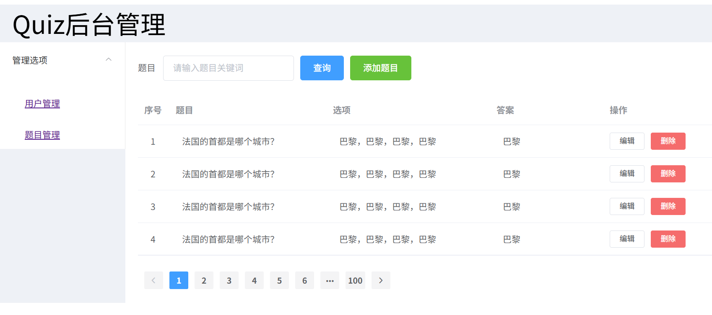
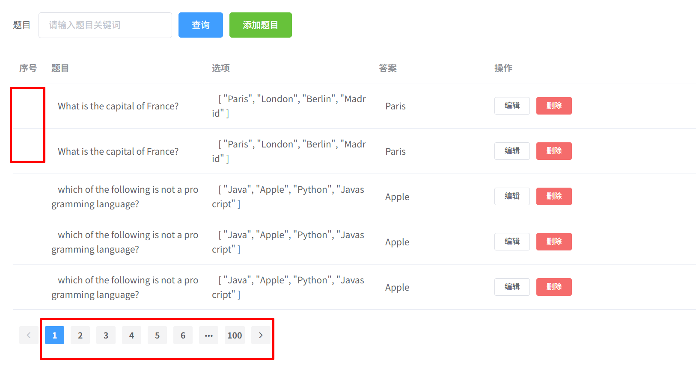
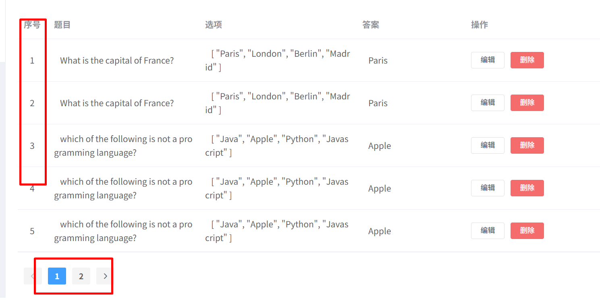
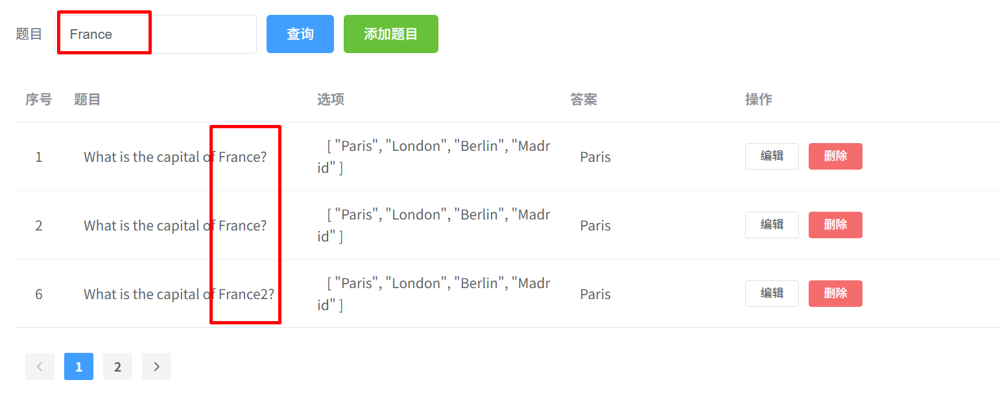
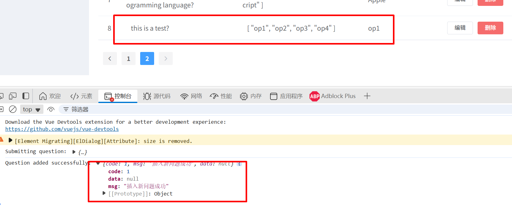
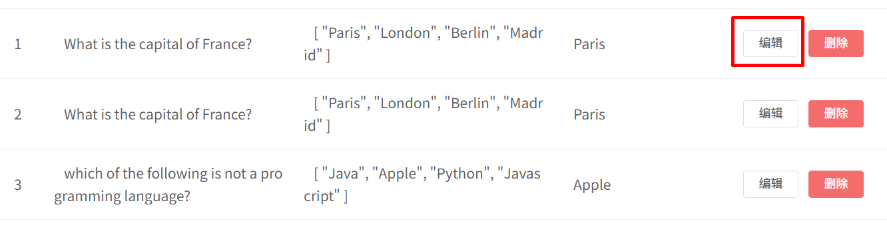

### 基于Element的前端管理端与Java后端的联调(上)

##### 1、前端管理端的题目pagination的实现：




**Vue异步向后端加载数据：**

1、安装axios：

```javascript
npm install axios
```

安装后，重启前端Vue项目；

2、当前使用axios的页面，导入axios包：

```javascript
import axios from 'axios';
```

在Vue对象的钩子方法，mounted中请求数据，以我们的QuestionView.Vue页面为例：

```javascript
//scripts中的mounted方法中，添加axios访问服务器api；
<script>
    mounted(){
        axios.get("/questions").then((response) => {
          // 假设返回的数据是一个数组
          console.log(response.data.data.qsBeanList);
          this.tableData = response.data.data.qsBeanList; // 更新表格数据
        }).catch((error) => {
          console.error("Error fetching questions:", error);
        });
	}
</script>
```

**注意：**这里的localhost:8080是我们Java后台的接口地址，

与Vue前端的接口8080冲突，

所以我们修改下前端的端口，比如改成8081；具体在vue.config.js中修改端口号：

```javascript
const { defineConfig } = require('@vue/cli-service')
module.exports = defineConfig({
  transpileDependencies: true,
  devServer: {
    port: 8081
  }
})
```

3、**跨域问题**:

因为前后端的端口不一致，因此访问时，会发生跨域问题，具体的错误信息如下：

```javascript
:8081/#/question:1  Access to XMLHttpRequest at 'http://localhost:8080/getQuestion' from origin 'http://localhost:8081' has been blocked by CORS policy: No 'Access-Control-Allow-Origin' header is present on the requested resource.
```

在开发环境中，前端代码通过配置代理的方式解决：

1. **配置代理**：在 [vue.config.js](vscode-file://vscode-app/d:/Programs/Microsoft VS Code/resources/app/out/vs/code/electron-browser/workbench/workbench.html) 文件中设置代理，将所有以 `/` 开头的请求转发到 `http://localhost:8080`。

   ```javascript
   const { defineConfig } = require('@vue/cli-service')
   module.exports = defineConfig({
     transpileDependencies: true,
       devServer: {
       port: 8081,
       proxy: {
         '/': {
           target: 'http://localhost:8080',
           changeOrigin: true,
           pathRewrite: {
             '^/': ''
           }
         }
       }
     }
   })
   ```

2. **修改API请求地址**：在 [QuestionView.vue](vscode-file://vscode-app/d:/Programs/Microsoft VS Code/resources/app/out/vs/code/electron-browser/workbench/workbench.html) 文件中，将 `axios` 请求的URL从绝对路径 `http://localhost:8080/getQuestion` 修改为相对路径 `/getQuestion`，以便让代理生效。

```javascript
    axios.get("/questions").then((response) => {
      // 假设返回的数据是一个数组
      console.log(response.data.data.qsBeanList);
      this.tableData = response.data.data.qsBeanList; // 更新表格数据
    }).catch((error) => {
      console.error("Error fetching questions:", error);
    });
```

同时，还需要修改QuestionView.vue中列表中的元素：

```vue
       <el-table :data="tableData" style="width: 80%">
          <el-table-column label="序号" width="50">
            <template slot-scope="scope">
              <!-- <i class="el-icon-time"></i> -->
              <span style="margin-left: 10px">{{ scope.row.id }}</span>
                <div slot="reference" class="name-wrapper">
                  <span style="margin-left: 10px">{{ scope.row.questionText }}</span>
              <span style="margin-left: 10px">{{ scope.row.options }}</span>
            </template>
              <span style="margin-left: 10px">{{ scope.row.answer }}</span>
            </template>
          </el-table-column>
```

上述的四个元素：

- scope.row.id，
- scope.row.questionText,  //此处原来的question要对应地修改为questionText;
- scope.row.options,
- scope.row.answer,

最终的测试结果：



当前页面存在的两个问题：

- 序号还不能显示；
- 页码不对；一共7个问题，每页显示5个，应该只有两页数据；

主要的原因：

- Java后端返回的数据中，没有将id返回；
- 前端的[分页组件](https://element.eleme.cn/#/zh-CN/component/pagination)没有接收参数；

**前端分页组件的修改：**

```javascript
//定义pageSize和total两个变量： 
return {
    dialogFormVisible: false,
    pageSize: 5, // 每页显示的条数
    total: 0,    // 总条数
    ...
}

//组件中绑定变量：
<el-pagination
  background
  layout="prev, pager, next"
  :page-size="pageSize"
  :total="total"
>
</el-pagination>

//mounted函数中，设置total值；
mounted() {
  axios.get("/questions").then((response) => {
    const data = response.data.data.qsBeanList;
    this.tableData = data; // 更新表格数据
    this.total = response.data.data.total; // 动态设置总条数
```

**题目id的显示：**

检查qsBeanList对象，不存在id属性；

```java
public class QSBeanOutManage {
    private String questionText;
    private List<String> options;
    private String answer;
}
```

1、在QSBeanOutManage中，增加id属性：

```java
public class QSBeanOutManage {
    private Integer id; //新增；
    private String questionText;
    private List<String> options;
    private String answer;
}
```

2、在Tool类的convertToQSBeanManageList方法中，添加对应的get/set方法；

```java
bean.setQuestionText(question.getQuestionText());
//设置id;
bean.setId(question.getId());
```

做完上述修改以后：



**pagination中的页面请求：**

当前点击不同的页面，没有反应，所以要给不同的页码按钮增加点击事件，加载不同页码对应的题目数据。

1、pagination中增加变量和方法：

```javascript
      <el-pagination
        background
        layout="prev, pager, next"
        :page-size="pageSize"
        :total="total"
		//新增变量以及绑定方法；
        :current-page="currentPage"
        @current-change="handlePageChange"
      />
```

2、在js脚本中的修改：

```javascript
export default {
  data() {
    return {
      currentPage: 1,
      pageSize: 5,
      total: 0,
      tableData: [],
    };
  },
  methods: {
    handlePageChange(page) {
      this.currentPage = page;
      axios
        .get(`/questions?page=${this.currentPage}&pageSize=${this.pageSize}`)
        .then((response) => {
          this.tableData = response.data.data.qsBeanList;
          this.total = response.data.data.total;
        })
        .catch((error) => {
          console.error("Error fetching questions:", error);
        });
    },
  },
  mounted() {
    // 初始化第一页数据
    this.handlePageChange(1);
  },
```

经过上述的修改后，可以点击页面来实现页面的切换。


##### 2、前端管理端的题目查询


上述输入框中，输入题目的关键词，再调用/findQuestion接口获取相关的题目；

a、在输入框组件中，设定keyword:

```javascript
//组件:
          <el-form-item label="题目">
            <el-input
              v-model="formInline.keyword" //改为keyword
              placeholder="请输入题目关键词"
            ></el-input>
          </el-form-item>
		
			//绑定onSearch()方法；
		   <el-form-item>
            <el-button type="primary" @click="onSearch">查询</el-button>
          </el-form-item>

//脚本中；
      formInline: {
        keyword: "",
        // region: "",
      },
          
    onSearch() {
      // 这里可以添加查询逻辑
      console.log("Searching for:", this.formInline.keyword);
      // 例如，调用API获取数据
      axios
        .get(`/findQuestion?keyword=${this.formInline.keyword}`)
        .then((response) => {
          this.tableData = response.data.data;
          console.log("Search results:", response.data);
          // this.total = response.data.data.total;
        })
        .catch((error) => {
          console.error("Error searching questions:", error);
        });
    },
```

结果：



**练习作业：**

1、关键词查询，启用分页；小于5条，只有1页；大于5条，只显示5条；

2、当前查询后，input这边不能自动清空，建议可以增加查询后清空的功能。


##### 3、前端管理端的题目添加

1、在组件中，添加onSubmitQuestion事件绑定；

```javascript
<el-button type="primary" @click="onAddNewQuestion">确 定</el-button>
```

2、js脚本中实现事件处理函数：

```javascript
export default {
  data() {
    return {
      dialogFormVisible: false,
      form: {
        question: "",
        optiona: "",
        optionb: "",
        optionc: "",
        optiond: "",
        answer: "",
      },
    };
  },
  methods: {
    onAddNewQuestion() {
      console.log("Submitting question:", this.form);
      axios
        .post("/addQuestion", this.form)
        .then((response) => {
          console.log("Question added successfully:", response.data);
          this.dialogFormVisible = false;
          this.handlePageChange(this.currentPage);
        })
        .catch((error) => {
          console.error("Error adding question:", error);
        });
    },
  },
};
</script>
```

**出现的问题：**

前端的确有数据发送到后端；

```javascript
    onSubmitQuestion() {
      console.log("Submitting question:", this.form);
      axios
        .post("/addQuestion", this.form)
```

但是后端没有正确接收到数据；

```java
    @PostMapping("/addQuestion")
    public Result addQuestion(QSBean question) {
        System.out.println(question);
```

**可能的原因：**前端发送的数据格式与后端的接收方式不一致。

**如何解决：**

前后端统一数据格式，均采用json格式：前端按json格式发送数据，后端按json格式接收及解析数据。

```javascript
        .post("/addQuestion", this.form,{
          headers: {
            "Content-Type": "application/json",
          },
        })
```

```java
@PostMapping("/addQuestion")
public Result addQuestion(@RequestBody QSBean question) {
    System.out.println(question);
    return Result.success("Question added successfully");
}
```

经过上述的修改，可以正常地插入数据(插入到最后)



**作业和练习：**

前端根据后端的返回，弹出一个对话框，告知用户，添加新问题成功。


##### 4、前端管理端的题目删除

1、删除按钮绑定事件函数；

```javascript
        <el-button
          size="mini"
          type="danger"
          @click="handleDelete(scope.$index, scope.row)"
          >删除</el-button
        >
```

2、在js脚本中，书写删除命令对应的函数：

```javascript
  handleDelete(index, row) {
    const id = row.id; // 获取当前条目的 id
    this.$confirm("此操作将永久删除该题目, 是否继续?", "提示", {
      confirmButtonText: "确定",
      cancelButtonText: "取消",
      type: "warning",
    })
      .then(() => {
        // 调用删除接口（GET 请求）
        axios
          .get(`/delQuestion?id=${id}`) // 使用 GET 请求传递 id 参数
          .then((response) => {
            console.log(response.data);
            // 删除成功后刷新当前页数据
            this.handlePageChange(this.currentPage);
          })
          .catch((error) => {
            console.error("Error deleting question:", error);
            this.$message({
              type: "error",
              message: "删除失败，请稍后重试!",
            });
          });
      })
      .catch(() => {
        this.$message({
          type: "info",
          message: "已取消删除",
        });
      });
  },
```

处理函数中需要注意的：

-  axios.get(`/delQuestion?id=${id}`) // 使用 GET 请求传递 id 参数


**作业和练习：**



实现"编辑"按钮的功能，点击后弹出对话框(类似于添加用户按钮)，

可以对questionText，各个optionText和answer的内容进行修改更新。

