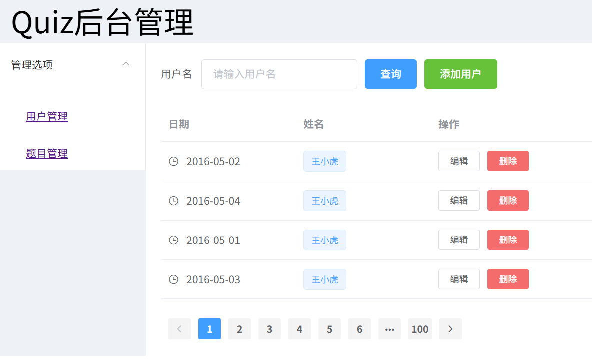
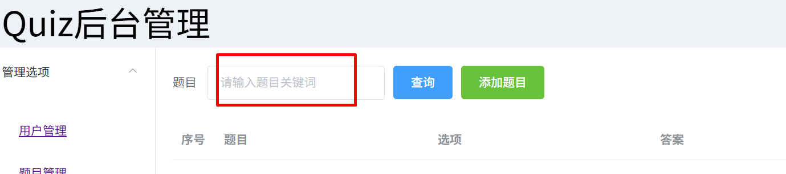
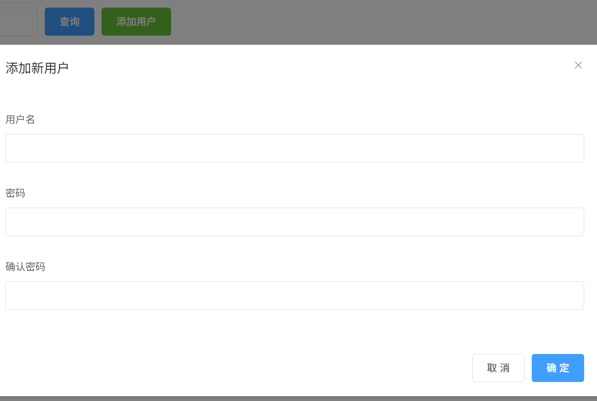

### 基于Element的前端管理端与Java后端的联调(中)

##### 1、前端管理端的用户pagination的实现：

**用户的分页组件：**



```javascript
        <el-table :data="tableData" style="width: 60%">
          <el-table-column label="日期" width="180">
            <template slot-scope="scope">
              <i class="el-icon-time"></i>
              <span style="margin-left: 10px">{{ scope.row.date }}</span>
            </template>
          </el-table-column>
          <el-table-column label="姓名" width="180">
            <template slot-scope="scope">
              <el-popover trigger="hover" placement="top">
                <p>姓名: {{ scope.row.name }}</p>
                <p>住址: {{ scope.row.address }}</p>
                <div slot="reference" class="name-wrapper">
                  <el-tag size="medium">{{ scope.row.name }}</el-tag>
                </div>
              </el-popover>
            </template>
          </el-table-column>
```

当前列表显示的用户信息：

- 日期：scope.row.date
- 用户名：scope.row.name

对照后台java的用户列表信息：

```java
PageBean{
    private Integer total;
    private List<User> row;
}

User{
    private Long id;
    private String userName;
    private String userPassword;
    private Integer isDelete;
    private Integer userRole;
    private Date createTime;
    private Date updateTime;
}
```

对照上述的User信息，组件处要修改：

- id, 对应scope.row.id
  - userName, 对应scope.row.userName

- updateTime,  对应scope.row.udpateTime


分页组件的"pageSize"、"current-page", "total"变量的绑定以及@current-change事件绑定：

```vue
<el-pagination
  background
  layout="prev, pager, next"
  :page-size="pageSize"
  :total="total"
  //新增变量以及绑定方法；
  :current-page="currentPage"
  @current-change="handlePageChange"
>
</el-pagination>
```

参考question那边的handlePageChange方法：

```javascript
	//数据模型：
	pageSize: 5, // 每页显示的条数
    total: 0,    // 总条数
    currentPage: 1,  //首页

   handlePageChange(page) {
      this.currentPage = page;
      axios
        .get(`/users?page=${this.currentPage}&pageSize=${this.pageSize}`)
        .then((response) => {
          this.tableData = response.data.data.row;
          this.total = response.data.data.total;
        })
        .catch((error) => {
          console.error("Error fetching questions:", error);
        });
    },
        
    mounted(){
        this.handlePageChange(1);
    }
```


##### 2、前端管理端的用户查询



上述输入框中，输入题目的关键词，再调用/findUser接口获取相关的题目；

a、在输入框组件中，设定keyword:

```javascript
//组件:
          <el-form-item label="题目">
            <el-input
              v-model="formInline.keyword" //改为keyword
              placeholder="请输入题目关键词"
            ></el-input>
          </el-form-item>
		
			//绑定onSearch()方法；
		   <el-form-item>
            <el-button type="primary" @click="onSearch">查询</el-button>
          </el-form-item>

//脚本中；
      formInline: {
        keyword: "",
        // region: "",
      },
          
    onSearch() {
      // 这里可以添加查询逻辑
      console.log("Searching for:", this.formInline.keyword);
      // 例如，调用API获取数据
      axios
        .get(`/findUser?keyword=${this.formInline.keyword}`)
        .then((response) => {
          this.tableData = response.data.data;
          console.log("Search results:", response.data);
          this.total = response.data.data.total;
        })
        .catch((error) => {
          console.error("Error searching questions:", error);
        });
    },
```

结果：


##### 3、前端管理端的用户添加



1、在组件中，添加onAddNewUser事件绑定；

```javascript
<el-button type="primary" @click="onAddNewUser">确 定</el-button>
```

2、js脚本中实现事件处理函数：

```javascript
export default {
  data() {
	...
  },
  methods: {
    onAddNewUser() {
      console.log("Submitting user:", this.form);
      axios
        .post("/register", this.form)
        .then((response) => {
          console.log("user register successfully:", response.data);
          this.dialogFormVisible = false;
          this.handlePageChange(this.currentPage);
        })
        .catch((error) => {
          console.error("Error adding question:", error);
        });
    },
  },
};
</script>
```

**出现的问题：**

前端的确有数据发送到后端；

```javascript
    onSubmitQuestion() {
      console.log("Submitting question:", this.form);
      axios
        .post("/register", this.form)
```

但是后端没有正确接收到数据；

```java
    @PostMapping("/register")
    public Result addUser(String username, String password, String checkpassword) {
    }
```

**可能的原因：**前端发送的数据格式与后端的接收方式不一致。

**如何解决：**

前后端统一数据格式，均采用json格式：前端按json格式发送数据，后端按json格式接收及解析数据。

```javascript
        .post("/register", this.form,{
          headers: {
            "Content-Type": "application/json",
          },
        })
```

```java

```

经过上述的修改，可以正常地插入数据(插入到最后)


**作业和练习：**

前端根据后端的返回，弹出一个对话框，告知用户，添加新用户成功。


##### 4、前端管理端的用户删除

1、删除按钮绑定事件函数；

```javascript
        <el-button
          size="mini"
          type="danger"
          @click="handleDelete(scope.$index, scope.row)"
          >删除</el-button
        >
```

2、在js脚本中，书写删除命令对应的函数：

```javascript
  handleDelete(index, row) {
    const id = row.id; // 获取当前用户的 id
    this.$confirm("此操作将永久删除该用户, 是否继续?", "提示", {
      confirmButtonText: "确定",
      cancelButtonText: "取消",
      type: "warning",
    })
      .then(() => {
        // 调用删除接口（GET 请求）
        axios
          .get(`/deleteById?id=${id}`) // 使用 GET 请求传递 id 参数
          .then((response) => {
            console.log(response.data);
            // 删除成功后刷新当前页数据
            this.handlePageChange(this.currentPage);
          })
          .catch((error) => {
            console.error("Error deleting question:", error);
            this.$message({
              type: "error",
              message: "删除失败，请稍后重试!",
            });
          });
      })
      .catch(() => {
        this.$message({
          type: "info",
          message: "已取消删除",
        });
      });
  },
```

处理函数中需要注意的：

-  axios.get(`/delteById?id=${id}`) // 使用 GET 请求传递 id 参数


**作业和练习：**

实现"编辑"按钮的功能，点击后弹出对话框(类似于添加用户按钮)，

可以对questionText，各个optionText和answer的内容进行修改更新。

