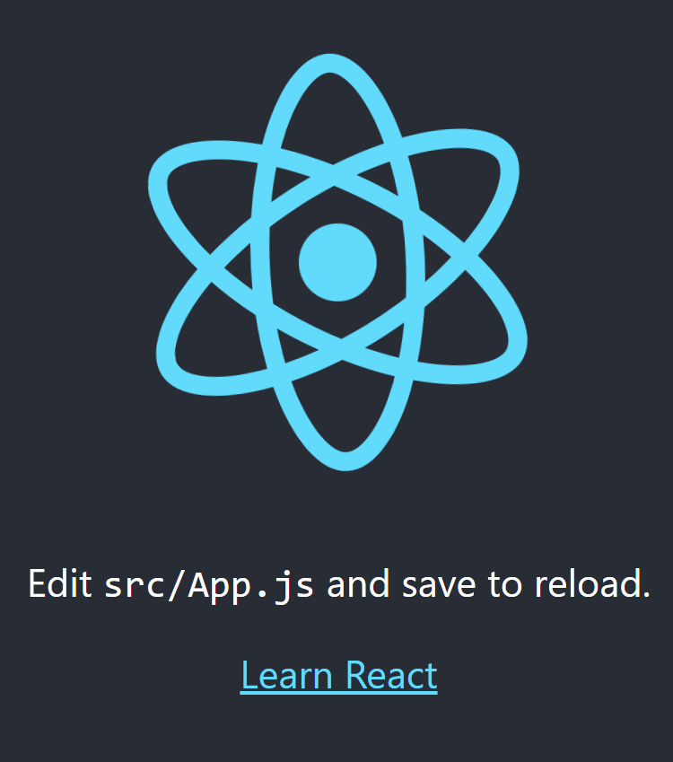

#### React入门介绍

参考：[react-07-state-2047868470_哔哩哔哩_bilibili](https://www.bilibili.com/video/BV1R7411j7NK/?p=11&spm_id_from=pageDriver&vd_source=b0e6d0da66db457c6afda440766d8139)

参考：[学习 - 宁皓网 (ninghao.net)](https://ninghao.net/learn)

参考：官方文档：[Quick Start – React](https://react.dev/learn)

[快速开始 – React 中文网](https://react.nodejs.cn/learn)


**1、创建新项目：**

首先确保你已经安装node.js和npm:

```javascript
node -v
npm -v
```

[Day1-02.React开发环境创建_哔哩哔哩_bilibili](https://www.bilibili.com/video/BV1ZB4y1Z7o8?spm_id_from=333.788.videopod.episodes&vd_source=b0e6d0da66db457c6afda440766d8139&p=3)

使用脚手架快速创建React项目：

```js
npx create-react-app first-app
```

first-app是我们项目的名称，当然你可以任意选定。上述的命令默认安装最新版本的React。

启动React项目：

```js
cd first-app
npm start
```

如果一切顺利，可以访问:

```html
http://localhost:3000
```

看到如下的页面：



对项目做必要的瘦身；

app.js -> index.js -> index.html


**2、React的主要概念：**

- React apps are made of components. 

- A component is a piece of the UI that has its own logic and appearance.
- Compoents can be nested.


1、如何创建component，并被其他component引用？

创建一个button的组件：

```javascript
function MyButton() {
  return (
    <button>I'm a button</button>
  );
}
```

如何在其他组件中引用：

```javascript
export default function MyApp() {
  return (
    <div>
      <h1>Welcome to my app</h1>
      <MyButton />
    </div>
  );
}
```

<font color=red>注意：组件首字母要大写。</font>

将上述的内容更新到App.js中，网页重新更新后的效果：


如上的MyButton组件和App.js写在同一个js文件，如果将MyButton组件写在其他源文件，供所有页面使用，应该如何操作呢？

- 根目录下创建components目录；

- 在components目录中，创建MyButton.js文件；

- MyButton.js文件内容填充，并在App.js通过如下方式引入该组件；

  ```javascript
  import MyButton from ../components/MyButton
  ```

但上述的操作会导致如下的问题：

```javascript
Module not found: Error: You attempted to import /components/MyButton which falls outside of the project src/ directory. Relative imports outside of src/ are not supported.
```

大意就是不能引用不是定义在src目录下的组件；如何修改也很简单，我们只需要将components目录及下面的MyButton.js文件一起移动到/src/目录下即可，这么做也合乎逻辑：<font color=red>代码尽量放置在一处。</font>其次，我们需要修改import语句中的路径如下：

```javascript
import MyButton from ./components/MyButton
```


概念：

react中的jsx语法与网页有所不同，比如css样式采用关键词className来声明，而不是class；

比如在App.js代码中:

```javascript
function App() {
  return (
    <div className="App">
      <h1>welcome to my app</h1>
      <MyButton />
    </div>
  );
}
```

其中的className为"App"的定义就在同目录的App.css文件：

```javascript
.App {
  text-align: center;
}
```


**此处引出一个问题：**

如果你在react使用一个现成的包含css网页，那么如何引入呢？不可能你将每个css的样式一一拷贝。

有待深入。。。。让我想到了拷贝tailwindcss模板时候的操作，你要保证不覆盖模板tailwindcss样式不覆盖模板原生的css样式。


**如何采用变量方式显示值？**

按照下面示例代码的逻辑，在return代码外定义要显示的数据来源。

```javascript
const user = {
  name: 'Hedy Lamarr',
  imageUrl: 'https://i.postimg.cc/4NMrN002/shuaige.jpg',
  imageSize: 90,
};

export default function Profile() {
  return (
    <>
      <h1>{user.name}</h1>
      
    </>
  );
}
```

<font color=red>注意：Alt+Shift+F，快捷键可以快速调整代码格式。</font>


**使用条件渲染：**

有些时候，我们需要按条件渲染（通俗地说，按条件显示组件到网页）；可以采用如下的写法：

```javascript
let content;
if (isLoggedIn) {
  content = <AdminPanel />;
} else {
  content = <LoginForm />;
}
return (
  <div>
    {content}
  </div>
);
```

也可以采用如下更简洁的写法：

```javascript
<div>
  {isLoggedIn ? (
    <AdminPanel />
  ) : (
    <LoginForm />
  )}
</div>
```

如果没有else部分内容，还可以写得更加简洁：

```javascript
<div>
  {isLoggedIn && <AdminPanel />}
</div>
```


**如何显示列表数据**

首先定义数组数据：

```javasc
const products = [
  { title: 'Cabbage', id: 1 },
  { title: 'Garlic', id: 2 },
  { title: 'Apple', id: 3 },
];
```

然后再使用map方法将数组转化为DOM对象列表：

```javascript
const listItems = products.map(product =>
  <li key={product.id}>
    {product.title}
  </li>
);

return (
  <ul>{listItems}</ul>
);
```

将上述的代码添加到App.js即可：

```javascript
function App() {

  const fruitItems = fruits.map(fruit =>
    <li key={fruit.id}>
      {fruit.title}
    </li>
  );

  return (
    <div className="App">
      <ul>{fruitItems}</ul>
      <h1>welcome to my app</h1>
      <MyButton />

    <h2>{user.name}</h2>
      
    </div>
  );
}
```

要注意如下的内容：

数组一定要具备key这个属性，用于区分不同的组件，要保证唯一性便于后续处理。原文如下：

Notice how `<li>` has a `key` attribute. For each item in a list, you should pass a string or a number that uniquely identifies that item among its siblings. Usually, a key should be coming from your data, such as a database ID. React uses your keys to know what happened if you later insert, delete, or reorder the items.


React**事件编程**

可以直接在组件内部定义事件，示例代码如下：

```jsx
function MyButton() {
  function handleClick() {
    alert('You clicked me!');
  }

  return (
    <button onClick={handleClick}>
      Click me
    </button>
  );
}
```

按照上述逻辑我们修改components中的MyButton.js的代码；即可以使用点击效果。


**保存页面状态：**

有时候我们需要组件存储某些状态信息，并且进行显示；

以按钮为例，希望存储截止目前位置的点击次数，并且进行显示；这个时候就需要为组件增加state变量；

要使用state变量，

步骤1：导入useState

```jsx
import {useState} from 'react'
```

步骤2：组件中声明变量

```jsx
function MyButton() {
  const [count, setCount] = useState(0);
  // ...
```

要声明变量，一定同时声明其更新方法，即[something, setSomething]的格式，其中count是我们声明的变量；而setcount表示我们要对count进行更新的方法；其中useState(0)表示将count初始化为0.

使用上述的逻辑，我们重新修改MyButton中的代码：

```jsx
function MyButton() {
  const [count, setCount] = useState(0);

  function handleClick() {
    setCount(count + 1);
  }

  return (
    <button onClick={handleClick}>
      Clicked {count} times
    </button>
  );
}
```

要使用注意，更新代码同时还需要如下的useState的引入语句：

```jsx
import {useState} from 'react'
```

另外，如果你在App.js中导入多个MyButton实例，则每个实例会享有自己的state状态变量，各自独立。


**React中的Hook**

在react中以use开头的函数称为钩子(hook)，比如useState.

hook继续深入可以查看[Built-in React Hooks – React](https://react.dev/reference/react)


**React中componts之间共享变量**

有些时候我们希望组件之间可以共享变量，以上述按钮的例子：

我们希望点击按钮1后，按钮2的数值也同步更新；而点击按钮2，按钮1的数值也可以同步的更新。

关键的思路：

**你需要将按钮中state变量的声明迁移到最近的同时包含两者的上一级父亲组件。**所以，

步骤1：

将关于state的声明与操作迁移到App.js(因为App.js是引用button的父级组件)；

步骤2：

在父级组件中，将state变量和方法传递给子组件；核心代码如下：

```jsx
export default function MyApp() {
  const [count, setCount] = useState(0);

  function handleClick() {
    setCount(count + 1);
  }

  return (
    <div>
      <h1>Counters that update together</h1>
      <MyButton count={count} onClick={handleClick} />
      <MyButton count={count} onClick={handleClick} />
    </div>
  );
}
```

步骤3：

修改MyButton组件代码，接收来自App.js的变量；核心代码如下：

```jsx
function MyButton({ count, onClick }) {
  return (
    <button onClick={onClick}>
      Clicked {count} times
    </button>
  );
}
```

在实际编程中我遇到一个错误提示：

```javascript
Objects are not valid as a React child (found: object with keys {count, onclick}). If you meant to render a collection of children, use an array instead.
    at throwOnInvalidObjectType (http://localhost:3000/static/js/bundle.js:20157:13)
    at createChild (http://localhost:3000/static/js/bundle.js:20369:11)
    at reconcileChildrenArray (http://localhost:3000/static/js/bundle.js:20586:29)
    at reconcileChildFibers (http://localhost:3000/static/js/bundle.js:20928:20)
    at reconcileChildren (http://localhost:3000/static/js/bundle.js:23860:32)
    at updateHostComponent (http://localhost:3000/static/js/bundle.js:24504:7)
    at beginWork (http://localhost:3000/static/js/bundle.js:25949:18)
    at beginWork$1 (http://localhost:3000/static/js/bundle.js:30888:18)
    at performUnitOfWork (http://localhost:3000/static/js/bundle.js:30157:16)
    at workLoopSync (http://localhost:3000/static/js/bundle.js:30080:9)
```

之所以出现这个错误的原因是MyButton.js中的第一句我写成如下：

```jsx
function MyButton(count, onClick)
```

遗漏掉了{}。

**源代码地址：**[nihao-react: 一个基于react官方https://react.dev/learn跟学的示例代码 (gitee.com)](https://gitee.com/bigbug55/nihao-react)


### React开发实践：井字棋小游戏

参考：[Tutorial: Tic-Tac-Toe – React](https://react.dev/learn/tutorial-tic-tac-toe)

参考中文版：https://react.nodejs.cn/learn/tutorial-tic-tac-toe


### React开发实践：采用组件思维开发

参考：[Thinking in React – React](https://react.dev/learn/thinking-in-react)

什么叫thinking in react? 看官方的原文描述：

React can change how you think about the designs you look at and the apps you build. When you build a user interface with React, you will first break it apart into pieces called *components*. Then, you will describe the different visual states for each of your components. Finally, you will connect your components together so that the data flows through them. 

要使用react实现UI，通常基于如下的步骤：

- 将要开发的界面划分组件架构；
- 开发静态UI版本；
- 最小且完整的UI状态集；
- 确定状态的管理者
- 增加数据流；


**步骤1：对界面划分组件架构**


根据上述界面的划分，得到如下的界面架构：

1. `FilterableProductTable` (grey) contains the entire app.
2. `SearchBar` (blue) receives the user input.
3. `ProductTable` (lavender) displays and filters the list according to the user input.
4. `ProductCategoryRow` (green) displays a heading for each category.
5. `ProductRow` (yellow) displays a row for each product.

并且形成如下的架构：

- FilterableProductTable
  - SearchBar
  - ProductTable
    - ProductCategoryRow
    - ProductRow


```react
const PRODUCTS = [
  {category: "Fruits", price: "$1", stocked: true, name: "Apple"},
  {category: "Fruits", price: "$1", stocked: true, name: "Dragonfruit"},
  {category: "Fruits", price: "$2", stocked: false, name: "Passionfruit"},
  {category: "Vegetables", price: "$2", stocked: true, name: "Spinach"},
  {category: "Vegetables", price: "$4", stocked: false, name: "Pumpkin"},
  {category: "Vegetables", price: "$1", stocked: true, name: "Peas"}
];
```

**步骤2：开发静态UI版本**

1、创建项目：

```jsx
npx create-react-app thinking-react
```

2、创建SearchBar组件；

写在App.js中的SearchBar组件的代码如下：

```jsx
    function SearchBar(){
      return (
        <form>
          <input type="text" placeholder="Search..." />
          <label>
            <input type="checkbox" />
            {' '}
            Only show products in stock
          </label>
        </form>
      );
    }
```

3、创建product row组件：

主要展现产品的商品名和价格，此处要注意如果商品的stocked为false，则显示商品为红色。所以代码中要有条件语句：

```jsx
function ProductRow({ product }) {
  const name = product.stocked ? product.name :
    <span style={{ color: 'red' }}>
      {product.name}
    </span>;

  return (
    <tr>
      <td>{name}</td>
      <td>{product.price}</td>
    </tr>
  );
}
```

注意上述的组件接收props：product。

除了商品的row，还需要增加关于产品类别的row：

```jsx
function ProductCategoryRow({ category }) {
  return (
    <tr>
      <th colSpan="2">
        {category}
      </th>
    </tr>
  );
}
```

4、创建关于row的array：

根据提供的row数据：

```jsx
const PRODUCTS = [
  {category: "Fruits", price: "$1", stocked: true, name: "Apple"},
  {category: "Fruits", price: "$1", stocked: true, name: "Dragonfruit"},
  {category: "Fruits", price: "$2", stocked: false, name: "Passionfruit"},
  {category: "Vegetables", price: "$2", stocked: true, name: "Spinach"},
  {category: "Vegetables", price: "$4", stocked: false, name: "Pumpkin"},
  {category: "Vegetables", price: "$1", stocked: true, name: "Peas"}
];
```

可以发现上述的数据已经按照类别划分，所以每次我们处理一行时，可以与最近一次的类别比较，来确定是否开始新的一个类别。

如果是新的一个类别的开始，则创建一个ProductCategoryRow；

同时创建一个productRow；具体的代码如下：

```jsx
function ProductTable({ products }) {
  const rows = [];
  let lastCategory = null;

  products.forEach((product) => {
    if (product.category !== lastCategory) {
      rows.push(
        <ProductCategoryRow
          category={product.category}
          key={product.category} />
      );
    }
    rows.push(
      <ProductRow
        product={product}
        key={product.name} />
    );
    lastCategory = product.category;
  });

  return (
    <table>
      <thead>
        <tr>
          <th>Name</th>
          <th>Price</th>
        </tr>
      </thead>
      <tbody>{rows}</tbody>
    </table>
  );
}
```

**key的重要性：**为每个动态生成的元素提供唯一的 key，帮助 React 高效更新。


5、将组件组合起来：

将搜索框与product table组合：

```jsx
function FilterableProductTable({ products }) {
  return (
    <div>
      <SearchBar />
      <ProductTable products={products} />
    </div>
  );
}
```

再将组件和数据结合：

```jsx
const PRODUCTS = [
  {category: "Fruits", price: "$1", stocked: true, name: "Apple"},
  {category: "Fruits", price: "$1", stocked: true, name: "Dragonfruit"},
  {category: "Fruits", price: "$2", stocked: false, name: "Passionfruit"},
  {category: "Vegetables", price: "$2", stocked: true, name: "Spinach"},
  {category: "Vegetables", price: "$4", stocked: false, name: "Pumpkin"},
  {category: "Vegetables", price: "$1", stocked: true, name: "Peas"}
];

export default function App() {
  return <FilterableProductTable products={PRODUCTS} />;
}
```

将上述所有代码整合到App.js中后，运行npm run start，我们获得如下的静态界面：


**步骤3：最小且完整的UI状态集；**

Think of state as the minimal set of changing data that your app needs to remember.

你的app只需要记住最小的数据集，非必要的数据尽量基于最小数据集计算而来。

在上述的示例中，涉及到的数据包括：

- 原始的产品列表；
- 搜索框中用户输入的内容；
- 单选框的状态；
- 过滤后的产品列表；

要确定哪些数据要保存为state，可以通过如下问题筛选：

- 不随时间而改变？是的话，不是state。
- 是否来自父级的props？是的话，不是state。
- 是否可以基于已有的state和props计算得到？是的话，不是state。

根据上述的筛选问题，我们的原始产品列表不是state；搜索框中的内容属于state；单选框的状态属于state；过滤后的产品列表不是state；所以真正的state只有：

- 搜索框中用户输入的内容；
- 单选框的状态；

<font color=red>props vs state：</font>

- props类似函数间传递的参数；
- state是组件的记忆单元；


**步骤4：确定state的管理者**

当你确定最小状态集后，接下来要确定哪个组件来负责管理该state。

根据如下的三个问题：

1、找到要使用该state的所有组件；

2、将该state放置到这些组件的父级组件；

3、如果你没找到合适的组件，也可以自己建一个组件来管理该状态；

在我们的例子中：

- productTable需要根据searchText和checkbox来显示row;
- SearchTable需要显示searchText和checkbox值；

而两者共同的父级组件是FilterableProductTable；所以我们可以将searchText和checkBox这两个state保存在FilterableProductTable中。

首先，我们在FilterableProductTable中声明两个变量：

```jsx
function FilterableProductTable({ products }) {
  const [filterText, setFilterText] = useState('');
  const [inStockOnly, setInStockOnly] = useState(false);
```

然后再将这两个变量作为props传递给子组件：

```jsx
    <div>
      <SearchBar filterText={filtertext}  inStockOnly={inStockOnly} />
      <ProductTable products={products} filterText={filtertext} inStockOnly={inStockOnly}/>
    </div>
```

对于两个组件的修改分别如下：

```jsx
function SearchBar({ filterText, inStockOnly }) {
  return (
    <form>
      <input 
        type="text" 
        value={filterText} 
        placeholder="Search..."/>
      <label>
        <input 
          type="checkbox" 
          checked={inStockOnly} />
        {' '}
        Only show products in stock
      </label>
    </form>
  );
}
```

另外对于ProductTable的修改：

```jsx
function ProductTable({ products, filterText, inStockOnly }) {
  const rows = [];
  let lastCategory = null;

  products.forEach((product) => {
    //名称过滤;
    if (product.name.toLowerCase().indexOf(filterText.toLowerCase()) === -1) {
      return;
    }
    //库存过滤；
    if (inStockOnly && !product.stocked) {
      return;
    }
    if (product.category !== lastCategory) {
      rows.push(
        <ProductCategoryRow
          category={product.category}
          key={product.category} />
      );
    }
    rows.push(
      <ProductRow
        product={product}
        key={product.name} />
    );
    lastCategory = product.category;
  });

  return (
    <table>
      <thead>
        <tr>
          <th>Name</th>
          <th>Price</th>
        </tr>
      </thead>
      <tbody>{rows}</tbody>
    </table>
  );
}
```

完成上述修改，重新加载网页后，虽然没有没有什么错误，但是输入不发生作用。这是我们接下来要解决的问题，就是界面对用户的输入有反应。

**步骤5：用户输入数据流**

之前的数据流动是从父级到子级，当我们用户输入时要改变界面，相当于数据从用户输入的子组件，作用 于父组件，然后再修改子组件的状态，相当于数据流动时反向的。

我们需要改变状态，但改变状态的方法在父级组件，而实际跟用户交互的是子级组件，那怎么办？

解决方法：将改变状态的方法从父级组件传递给子级组件。

FilterableProductTable中的内容修改如下：

```jsx
function FilterableProductTable({ products }) {
  const [filterText, setFilterText] = useState('');//空，不是空字符串;
  const [inStockOnly, setInStockOnly] = useState(false);

  
  return (
    <div>
      <SearchBar 
        filterText={filterText} 
        inStockOnly={inStockOnly} 
        onFilterTextChange={setFilterText} 
        onInStockOnlyChange={setInStockOnly} />
      <ProductTable 
        products={products} 
        filterText={filterText}
        inStockOnly={inStockOnly} />	
    </div>
  );
}
```

注意SearchBar中添加的如下两句：

```jsx
        onFilterTextChange={setFilterText} 
        onInStockOnlyChange={setInStockOnly}
```

另外，在SearchBar中的修改：

```jsx
function SearchBar({filterText, inStockOnly, onFilterTextChange, onInStockOnlyChange}) {
  return (
    <form>
      <input type="text" value={filterText} placeholder="Search..." 
      onChange={(e)=>onFilterTextChange(e.target.value)}
      />
      <br />
      <label>
        <input type="checkbox" 
        checked={inStockOnly}
        onChange={(e)=>onInStockOnlyChange(e.target.checked)}
        />

        {' '}
        Only show products in stock
      </label>
    </form>
  );
}
```

主要的思路就是增加两个onChange方法，然后重启代码后，可以正常地看到SearchBar可以对用户的输入正确的反应。

**源代码地址：**

[bigbug55/thinking-in-react (gitee.com)](https://gitee.com/bigbug55/thinking-in-react)


#### NextJS中使用React

参考文献：[Getting Started: React Essentials | Next.js (nextjs.org)](https://nextjs.org/docs/getting-started/react-essentials)

**什么时候使用useContext?**

使用useContext主要为了便于components共享与访问全局变量，以及重新渲染当context的值发生改变。如何使用useContext()呢？

**步骤1：create a context**

```jsx
import React from 'react';

// Create a context
const MyContext = React.createContext();
```

**步骤2：创建一个provider初始化context的值**

```jsx
import React from 'react';
// Create a context
const MyContext = React.createContext();

// Create a provider component
const MyProvider = ({ children }) => {
  const value = 'Hello from context';

  return (
    <MyContext.Provider value={value}>
      {children}
    </MyContext.Provider>
  );
};
```

**步骤3：访问context值**

```jsx
import React, { useContext } from 'react';
// Create a context
const MyContext = React.createContext();

// Create a provider component
const MyProvider = ({ children }) => {
  const value = 'Hello from context';

  return (
    <MyContext.Provider value={value}>
      {children}
    </MyContext.Provider>
  );
};

// Consume the context value
const MyComponent = () => {
  const value = useContext(MyContext);

  return (
    <div>
      <p>{value}</p>
    </div>
  );
};
```

