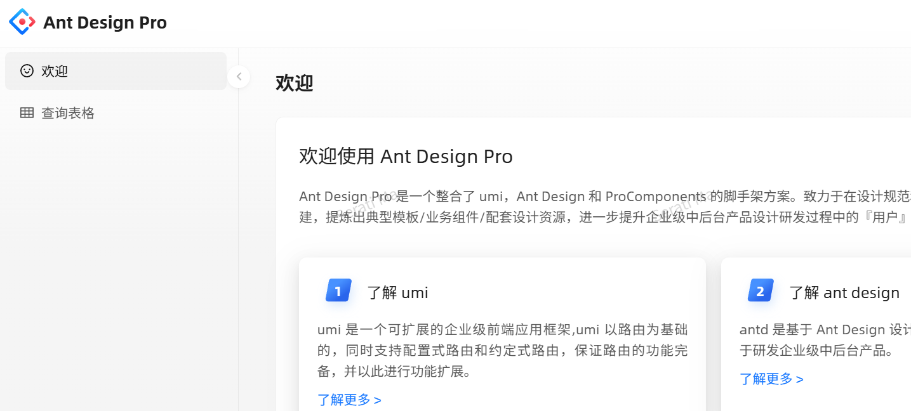
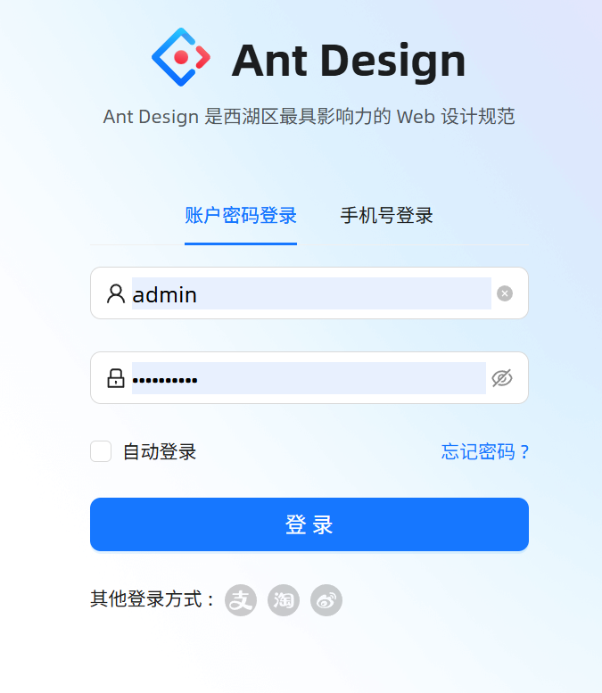
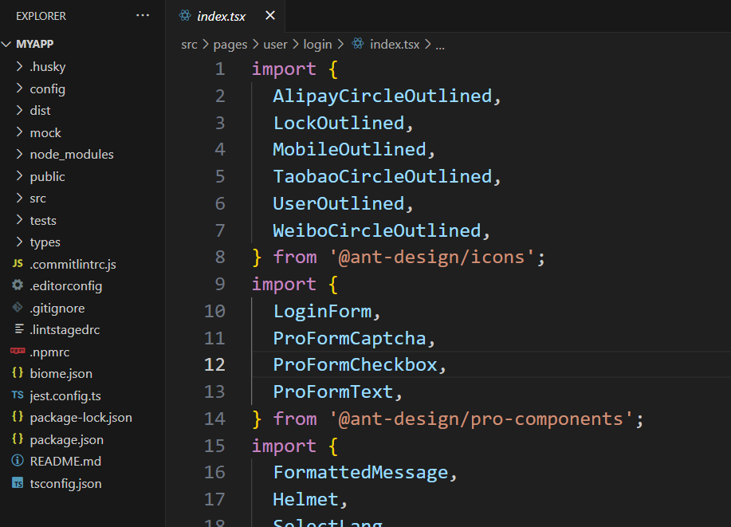

#### React工程化-使用Ant Design Pro

参考：https://pro.ant.design/zh-CN/


##### 1、创建启动新项目：

https://pro.ant.design/zh-CN/docs/getting-started

首先确保你已经安装node.js和npm:

```javascript
node -v
//v20.17.0
npm -v
//10.8.2
```

使用脚手架快速创建Ant Design项目：

```js
//使用 npm
npm i @ant-design/pro-cli -g
pro create myapp
```

选择简单的脚手架：

```javascript
? 🚀 要全量的还是一个简单的脚手架? (Use arrow keys)
❯ simple
  complete
```

安装依赖并启动：

```javascript
$ cd myapp && npm install
$ npm run start
```

浏览器本地打开：http://localhost:8000，可以看到启动的网页：





使用visual studio coder打开项目文件：



/src中默认使用typescript，后缀为.tsx，TypeScript是Javascript的一个超集，它添加了静态类型系统和其他特性，最终会被编译成纯Javascript来运行。

点击查看：[文件夹结构 - Ant Design Pro](https://pro.ant.design/zh-CN/docs/folder)


##### 2、项目修改：

目标将上述默认的Ant Design Pro项目修改为Quiz的管理端前端，主要的步骤：

- 1、修改登录页；
- 2、修改后台管理页，每个页面怎么改；
- 3、添加对后端接口的访问；


**2.1、修改登录页：**


