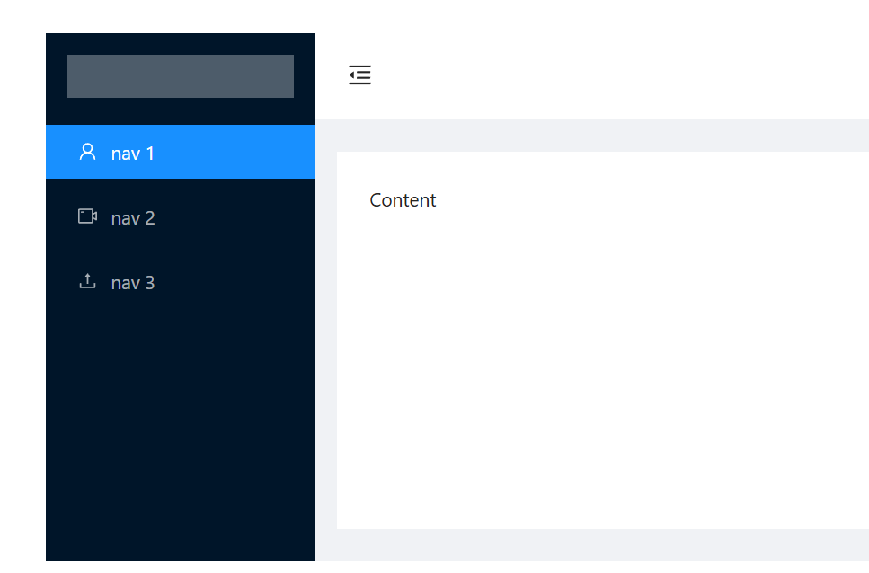
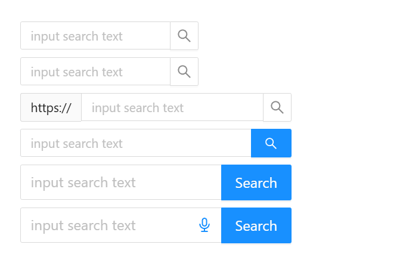
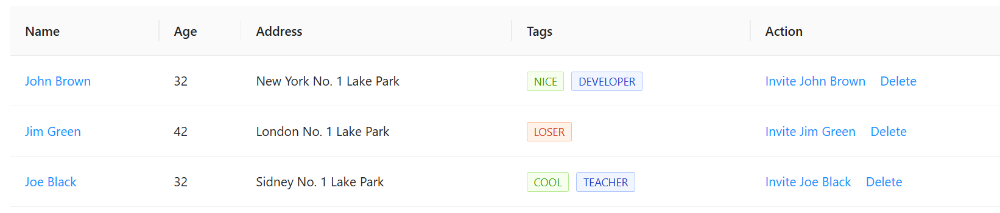
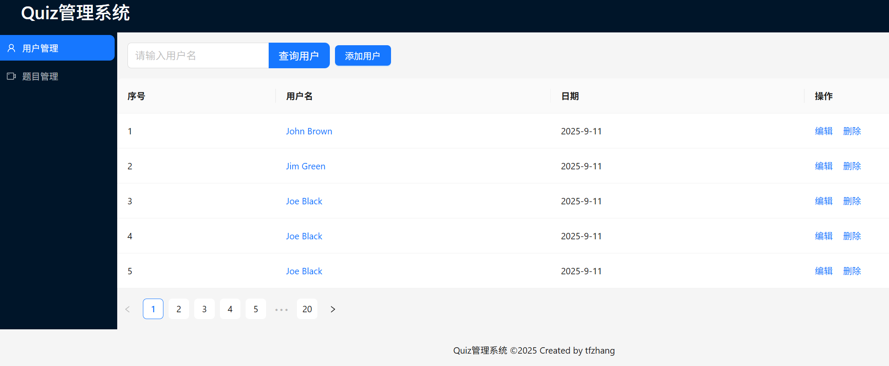
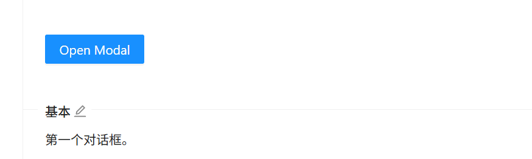
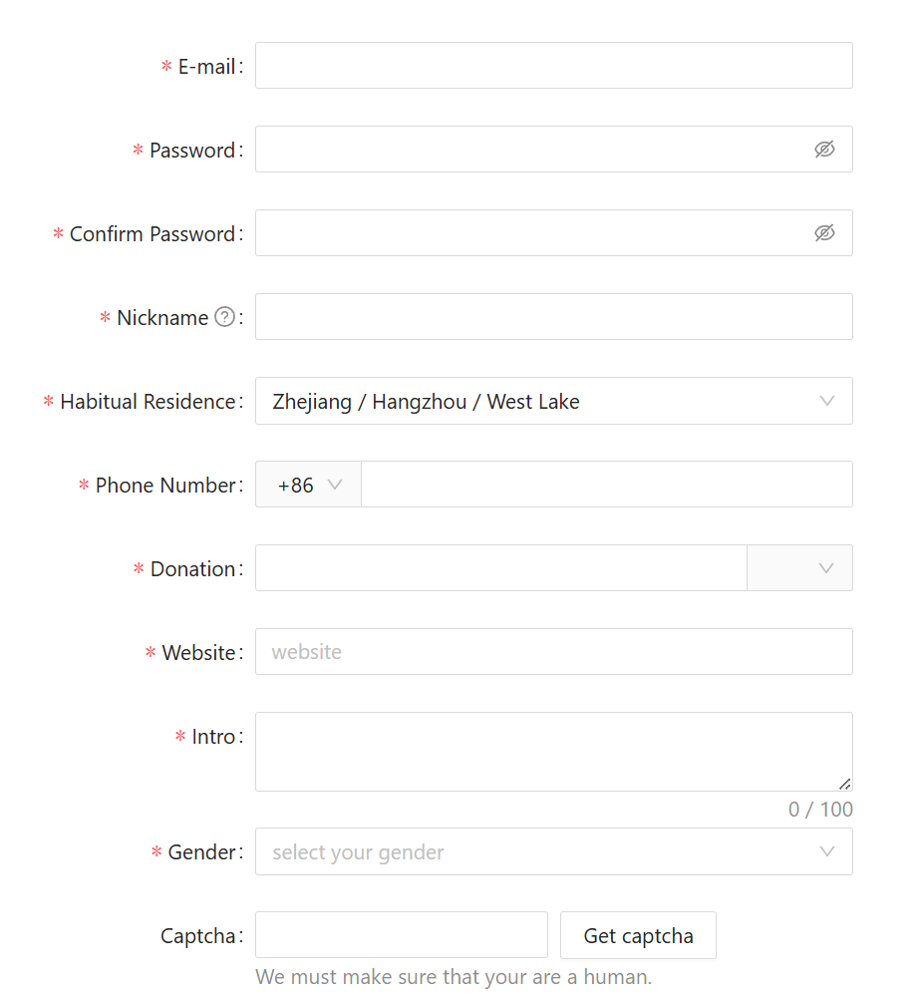
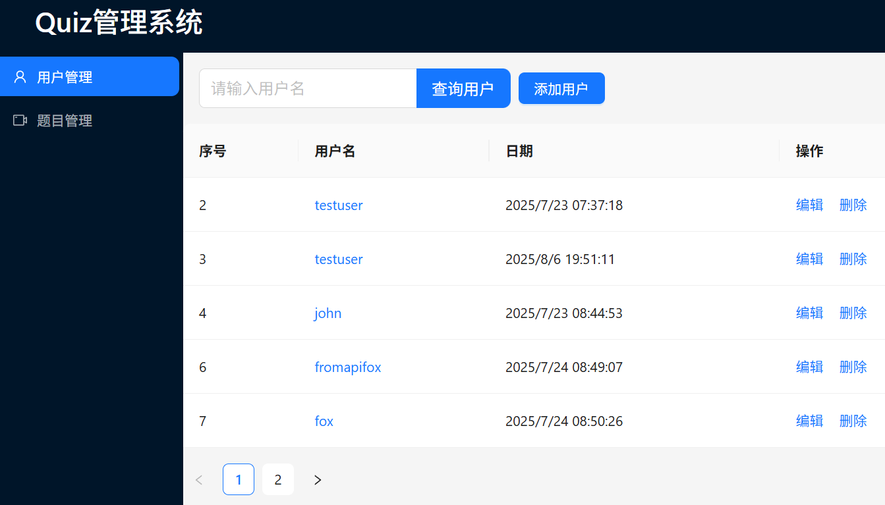
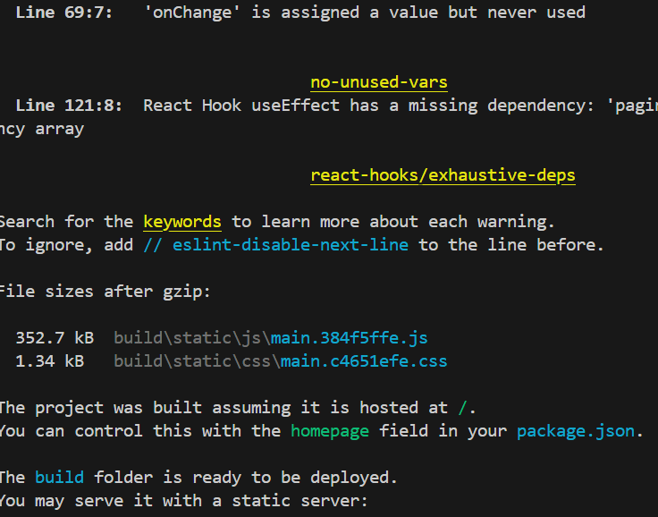
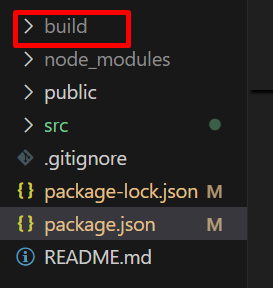
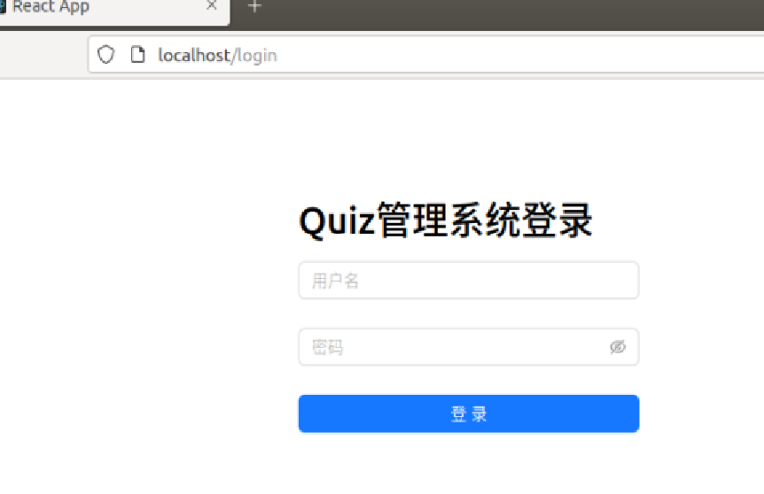

#### React工程化-使用Ant Design

参考：

[Ant Design - 一套企业级 UI 设计语言和 React 组件库](https://4x-ant-design.antgroup.com/index-cn)

##### 1、创建启动新项目：

[在 create-react-app 中使用 - Ant Design](https://4x-ant-design.antgroup.com/docs/react/use-with-create-react-app-cn)

主要步骤：

```javascript
$ npx create-react-app antd-demo
$ cd antd-demo
$ npm run start
//npm安装并引入antd
$ npm add antd
```

修改 `src/App.js`，引入 antd 的按钮组件：

```javascript
import React from 'react';
import { Button } from 'antd';
import './App.css';

const App = () => (
  <div className="App">
    <Button type="primary">Button</Button>
  </div>
);

export default App;
```

修改 `src/index.js`，在文件顶部引入 `antd/dist/antd.css`:

```javascript
import 'antd/dist/reset.css'; 
```


##### 2、组件库选取组件：

[组件总览 - Ant Design](https://4x-ant-design.antgroup.com/components/overview-cn/)

2.1 选取布局组件：

```react
import { Layout } from 'antd';
import React from 'react';
const { Header, Footer, Sider, Content } = Layout;
const App = () => (
  <>
    <Layout>
      <Header>Header</Header>
      <Layout>
        <Sider>Sider</Sider>
        <Content>Content</Content>
      </Layout>
      <Footer>Footer</Footer>
    </Layout>
  </>
);
export default App;
```

将header部分内容修改如下：

```react
<Header><h1>Quiz管理系统</h1></Header>
```

2.2 选取siderbar组件：



选择上述界面的sidebar代码：

```react
      <Sider trigger={null} collapsible collapsed={collapsed}>
        <div className="logo" />
        <Menu
          theme="dark"
          mode="inline"
          defaultSelectedKeys={['1']}
          items={[
            {
              key: '1',
              icon: <UserOutlined />,
              label: 'nav 1',
            },
            {
              key: '2',
              icon: <VideoCameraOutlined />,
              label: 'nav 2',
            },
            {
              key: '3',
              icon: <UploadOutlined />,
              label: 'nav 3',
            },
          ]}
        />
      </Sider>
```

2.3 选取输入框：



[输入框 Input - Ant Design](https://4x-ant-design.antgroup.com/components/input-cn/)

选取及修改后的代码：

```react
import { AudioOutlined } from '@ant-design/icons';
import { Input, Space, Button } from 'antd';
import React from 'react';

const { Search } = Input;
const suffix = (
  <AudioOutlined
    style={{
      fontSize: 16,
      color: '#1890ff',
    }}
  />
);
const onSearch = (value) => console.log(value);

const App = () => (
  <Space direction="horizontal">
    <Search
      placeholder="请输入用户名"
      allowClear
      enterButton="查询用户"
      size="large"
      onSearch={onSearch}
    />
    <Button type="primary" onClick={() => alert('自定义按钮点击')}>
      自定义按钮
    </Button>
  </Space>
);
export default App;
```

2.4 选取展示用户数据的table及分页：

[表格 Table - Ant Design](https://4x-ant-design.antgroup.com/components/table-cn/#components-table-demo-basic)



对应的代码如下，其对应的代码：

```react
import { Space, Table } from 'antd';
import React from 'react';
const columns = [
    {
        title: '序号',
        dataIndex: 'id',
        key: 'id',
    },
    {
        title: '用户名',
        dataIndex: 'name',
        key: 'name',
        render: (text) => <a>{text}</a>,
    },
    {
        title: '日期',
        dataIndex: 'date',
        key: 'date',
    },
    {
        title: '操作',
        key: 'action',
        render: (_, record) => (
            <Space size="middle">
                <a>编辑</a>
                <a>删除</a>
            </Space>
        ),
    },
];
const data = [
    {
        key: '1',
        id: '1',
        name: 'John Brown',
        date: '2025-9-11'
    },
    {
        key: '2',
        id: '2',
        name: 'Jim Green',
        date: '2025-9-11'
    },
    {
        key: '3',
        id: '3',
        name: 'Joe Black',
        date: '2025-9-11'
    },
    {
        key: '4',
        id: '4',
        name: 'Joe Black',
        date: '2025-9-11'
    },
    {
        key: '5',
        id: '5',
        name: 'Joe Black',
        date: '2025-9-11'
    }
];

const onChange = (pagination, filters, sorter, extra) => {
    console.log('params', pagination, filters, sorter, extra);
};

const App = () => <Table
    columns={columns}
    dataSource={data}
    pagination={{
        current: 1, // 当前页码
        pageSize: 5, // 每页条数
        total: 100, // 数据总数
        showSizeChanger: false,
        position: ['bottomLeft'],
        onChange: () => { /* 页码或每页条数变化时的回调 */ },
    }}
    onChange={onChange} />;
export default App;
```

2.5 调整Footer：

```react
      <Footer style={{
        textAlign: 'center',
      }}
      >Quiz管理系统 ©2025 Created by tfzhang</Footer>
```

最后得到的页面：




##### 3、用户页与题目页：

直接询问github copilot如下的prompt：

```cmd
当前的Sider中有两个选项，用户管理和题目管理，现在希望点击用户管理后，<content>中显示用户管理的页面；点击题目管理，<content>中显示题目管理的页面。
```

github copilot的回复：

```react
你可以通过在 App.js 中使用 React 的 useState 来控制 <Content> 区域显示不同页面。具体做法如下：
添加一个 state 用于记录当前选中的菜单项。
给 Menu 添加 onClick 事件，切换 state。
根据 state 渲染不同的内容。

示例代码：
const { Header, Footer, Sider, Content } = Layout;
const App = () => {
  const [selectedKey, setSelectedKey] = useState('1');

  return (
    <Layout>
      <Header><h1>Quiz管理系统</h1></Header>
      <Layout>
        <Sider>
          <Menu
            theme="dark"
            mode="inline"
            defaultSelectedKeys={['1']}
            onClick={({ key }) => setSelectedKey(key)}
            items={[
              { key: '1', icon: <UserOutlined />, label: '用户管理' },
              { key: '2', icon: <VideoCameraOutlined />, label: '题目管理' }
            ]}
          />
        </Sider>
        <Content>
          {selectedKey === '1' && (
            <>
              <SearchBar />
              <UserTable />
            </>
          )}
          {selectedKey === '2' && (
            <div>题目管理页面内容</div>
          )}
        </Content>
```

参照上述代码，对页面进行修改。

**复制SearchBar和UserTable：**

将SearchBar和UserTable分别复制为SearchQuestion和QuestionTable两个文件，其中的内容再进行微调；

```react
//SearchQuestion.js的源代码:
import { AudioOutlined } from '@ant-design/icons';
import { Input, Space, Button } from 'antd';
import React from 'react';

const { Search } = Input;
const suffix = (
  <AudioOutlined
    style={{
      fontSize: 16,
      color: '#1890ff',
    }}
  />
);
const onSearch = (value) => console.log(value);
const App = () => (
  <Space direction="horizontal" style={{ margin: '16px 0 16px 16px' }}>
    <Search
      placeholder="请输入关键词"
      allowClear
      enterButton="查询题目"
      size="large"
      onSearch={onSearch}
    />
    <Button type="primary" onClick={() => alert('添加题目')}>
      添加题目
    </Button>
  </Space>
);
export default App;
```

```react
//QuestionTable.js的源代码：
import { render } from '@testing-library/react';
import { Space, Table } from 'antd';
import React from 'react';
const columns = [
    {
        title: '序号',
        dataIndex: 'id',
        key: 'id',
    },
    {
        title: '题目',
        dataIndex: 'question',
        key: 'question',
        render: (text) => <a>{text}</a>,
    },
    {
        title: '选项',
        dataIndex: 'options',
        key: 'options',
        render: (options) => options.join(', ')
    },
    {
        title: '答案',
        dataIndex: 'answer',
        key: 'answer',
    },
    {
        title: '操作',
        key: 'action',
        render: (_, record) => (
            <Space size="middle">
                <a>编辑</a>
                <a>删除</a>
            </Space>
        ),
    },
];
const data = [
    {
        key: '1',
        id: '1',
        question: '什么是React？',
        options: ['A. 一个库', 'B. 一个框架', 'C. 一个语言'],
        answer: 'A'
    },
    {
        key: '2',
        id: '2',
        question: 'React的生命周期函数有哪些？',
        options: ['A. componentDidMount', ' B. componentDidUpdate', ' C. componentWillUnmount'],
        answer: 'A'
    },
    {
        key: '3',
        id: '3',
        question: 'React的状态管理有哪些方式？',
        options: ['A. Redux', ' B. MobX', ' C. Context API'],
        answer: 'A'
    },
    {
        key: '4',
        id: '4',
        question: 'React的性能优化手段有哪些？',
        options: ['A. 代码分割', ' B. 懒加载', 'C. 服务器端渲染'],
        answer: 'A'
    },
    {
        key: '5',
        id: '5',
        question: 'React的路由管理有哪些方式？',
        options: ['A. React Router', 'B. Next.js', 'C. Reach Router'],
        answer: 'A'
    }
];

const onChange = (pagination, filters, sorter, extra) => {
    console.log('params', pagination, filters, sorter, extra);
};

const App = () => <Table
    columns={columns}
    dataSource={data}
    pagination={{
        current: 1, // 当前页码
        pageSize: 5, // 每页条数
        total: 100, // 数据总数
        showSizeChanger: false,
        position: ['bottomLeft'],
        onChange: () => { /* 页码或每页条数变化时的回调 */ },
    }}
    onChange={onChange} />;
export default App;
```


**添加题目以及添加用户页**：

需要弹窗的组件：[对话框 Modal - Ant Design](https://4x-ant-design.antgroup.com/components/modal-cn/)



```react
//弹窗的代码：
import { Button, Modal } from 'antd';
import React, { useState } from 'react';
const App = () => {
  const [isModalOpen, setIsModalOpen] = useState(false);
  
  const showModal = () => {
    setIsModalOpen(true);
  };
  const handleOk = () => {
    setIsModalOpen(false);
  };
  const handleCancel = () => {
    setIsModalOpen(false);
  };
  return (
    <>
      <Button type="primary" onClick={showModal}>
        Open Modal
      </Button>
      <Modal title="Basic Modal" open={isModalOpen} onOk={handleOk} onCancel={handleCancel}>
        <p>Some contents...</p>
        <p>Some contents...</p>
        <p>Some contents...</p>
      </Modal>
    </>
  );
};
export default App;
```

需要将上述的代码整合到SearchBar.js中，再获取[表单 Form - Ant Design](https://4x-ant-design.antgroup.com/components/form-cn/)，使用如下的组件并进行裁剪：



整合到弹窗中，并且裁剪无关的代码，裁剪后端的AddNew.js代码如下：

```react
//AddNew.js的源代码：
import { Form, Input, Button } from 'antd';
import React from 'react';

const formItemLayout = {
  labelCol: { xs: { span: 24 }, sm: { span: 8 } },
  wrapperCol: { xs: { span: 24 }, sm: { span: 16 } },
};
const tailFormItemLayout = {
  wrapperCol: { xs: { span: 24, offset: 0 }, sm: { span: 16, offset: 8 } },
};

const App = () => {
  const [form] = Form.useForm();
  const onFinish = (values) => {
    console.log('Received values of form: ', values);
  };
  return (
      <Form
        {...formItemLayout}
        form={form}
        name="register"
        onFinish={onFinish}
        scrollToFirstError
      >
        <Form.Item
          name="username"
          label="用户名"
          rules={[{
            type: 'username',
            message: 'The input is not valid username!',
          }, {
            required: true,
            message: 'Please input your username!',
          }]}
        >
        <Input />
        </Form.Item>

        <Form.Item
          name="password"
          label="密码"
          rules={[{
            required: true,
            message: 'Please input your password!',
          }]}
          hasFeedback
        >
          <Input.Password />
        </Form.Item>

        <Form.Item
          name="confirm"
          label="确认密码"
          dependencies={['password']}
          hasFeedback
          rules={[{
            required: true,
            message: 'Please confirm your password!',
          }, ({ getFieldValue }) => ({
            validator(_, value) {
              if (!value || getFieldValue('password') === value) {
                return Promise.resolve();
              }
              return Promise.reject(new Error('The two passwords that you entered do not match!'));
            },
          })]}
        >
          <Input.Password />
        </Form.Item>

        <Form.Item {...tailFormItemLayout}>
          <Button type="primary" htmlType="submit">
            提交
          </Button>
        </Form.Item>
      </Form>
    );
  };
export default App;
```

SearchBar整合弹窗和AddNew.js后的代码：

```react
import { AudioOutlined } from '@ant-design/icons';
import { Input, Space, Button } from 'antd';
import React from 'react';
import { useState } from 'react';
import { Modal } from 'antd';
// import { useState } from 'react';
import AddNew from './AddNew';

const { Search } = Input;
const suffix = (
  <AudioOutlined
    style={{
      fontSize: 16,
      color: '#1890ff',
    }}
  />
);
const onSearch = (value) => console.log(value);

const App = () => {

  const [open, setOpen] = useState(false);

  const showModal = () => {
    setOpen(true);
  };
  const handleOk = () => {
    // setModalText('The modal will be closed after two seconds');
    setOpen(false);
  };
  const handleCancel = () => {
    console.log('Clicked cancel button');
    setOpen(false);
  };

  return (
    <>
      <Space direction="horizontal" style={{ margin: '16px 0 16px 16px' }}>
        <Search
          placeholder="请输入用户名"
          allowClear
          enterButton="查询用户"
          size="large"
          onSearch={onSearch}
        />

        <Button type="primary" onClick={showModal}>
          添加用户
        </Button>
        <Modal
          title="添加用户"
          open={open}
          onOk={handleOk}
          onCancel={handleCancel}
        >
          <AddNew />
        </Modal>

      </Space>
    </>
  );
}
export default App;
```

##### 4、请求后端数据

**4.1 UserTable.js获取用户分页数据：**

参照之前的element ui的代码：

```vue
    handlePageChange(page) {
      this.currentPage = page;
      axios
        .get(`/users?page=${this.currentPage}&pageSize=${this.pageSize}`)
        .then((response) => {
          console.log("获取用户数据:", response.data);
          this.tableData = response.data.data.row;  
          this.total = response.data.data.total;
        })
        .catch((error) => {
          console.error("Error fetching users:", error);
        });
```

需要安装axios:

```javascript
npm install axios
```

修改UserTable.js的代码：

```react
import { Space, Table } from 'antd';
import React from 'react';
import axios from 'axios';

import {useState, useEffect} from 'react';

const columns = [
    {
        title: '序号',
        dataIndex: 'id',
        key: 'id',
    },
    {
        title: '用户名',
        dataIndex: 'name',
        key: 'name',
        render: (text) => <a>{text}</a>,
    },
    {
        title: '日期',
        dataIndex: 'date',
        key: 'date',
    },
    {
        title: '操作',
        key: 'action',
        render: (_, record) => (
            <Space size="middle">
                <a>编辑</a>
                <a>删除</a>
            </Space>
        ),
    },
];
const data = [
    {
        key: '1',
        id: '1',
        name: 'John Brown',
        date: '2025-9-11'
    },
    {
        key: '2',
        id: '2',
        name: 'Jim Green',
        date: '2025-9-11'
    },
    {
        key: '3',
        id: '3',
        name: 'Joe Black',
        date: '2025-9-11'
    },
    {
        key: '4',
        id: '4',
        name: 'Joe Black',
        date: '2025-9-11'
    },
    {
        key: '5',
        id: '5',
        name: 'Joe Black',
        date: '2025-9-11'
    }
];

const onChange = (pagination, filters, sorter, extra) => {
    console.log('params', pagination, filters, sorter, extra);
};

const App = () => {
    const [data, setData] = useState([]);
    
    const [pagination, setPagination] = useState({
        current: 1,
        pageSize: 5,
        total: 0,
        showSizeChanger: false,
        position: ['bottomLeft'],
    });
    const [loading, setLoading] = useState(false);

    const fetchData = (page = 1, pageSize = 5) => {
        setLoading(true);
        axios
            .get(`http://localhost:8080/users?page=${page}&pageSize=${pageSize}`)
            .then((response) => {
                const res = response.data;
                setData(res.data.row.map((item, idx) => ({
                    ...item,
                    key: item.id || idx,
                })));
                setPagination((prev) => ({
                    ...prev,
                    current: page,
                    pageSize: pageSize,
                    total: res.data.total,
                }));
            })
            .catch((error) => {
                console.error("Error fetching users:", error);
            })
            .finally(() => {
                setLoading(false);
            });
    };

    useEffect(() => {
        fetchData(pagination.current, pagination.pageSize);
    }, []);

    const handleTableChange = (pag) => {
        fetchData(pag.current, pag.pageSize);
    };

    return (
        <Table
            columns={columns}
            dataSource={data}
            pagination={pagination}
            loading={loading}
            onChange={handleTableChange}
        />
    );
};
export default App;
```

增加对应数据：id, userName和updateTime的渲染显示：

```react
    {
        title: '序号',
        dataIndex: 'id',
        key: 'id',
    },
    {
        title: '用户名',
        dataIndex: 'userName',
        key: 'userName',
        render: (text) => <a>{text}</a>,
    },
    {
        title: '日期',
        dataIndex: 'updateTime',
        key: 'updateTime',
        render: (text) => text ? new Date(text).toLocaleString() : '',
    },
   ...
    const fetchData = (page = 1, pageSize = 5) => {
        setLoading(true);
        axios
            .get(`http://localhost:8080/users?page=${page}&pageSize=${pageSize}`)
            .then((response) => {
                const res = response.data;
            
                setData(res.data.row.map((item) => ({
                    key: item.id,
                    id: item.id,
                    userName: item.userName,
                    updateTime: item.updateTime,
                })));

                setPagination((prev) => ({
                    ...prev,
                    current: page,
                    pageSize: pageSize,
                    total: res.data.total,
                }));
            })
            .catch((error) => {
                console.error("Error fetching users:", error);
            })
            .finally(() => {
                setLoading(false);
            });
    };
```

最终显示的usertable如下：



##### 5、用户管理页的其他请求：

。。。

##### 6、登录页的添加：

**6.1不采用路由的方式：**

在src目录中增加Login.js文件：

```react
import React, { useState } from 'react';
import { Form, Input, Button, message } from 'antd';

const Login = ({ onLogin }) => {
  const [loading, setLoading] = useState(false);

  const handleFinish = (values) => {
    setLoading(true);
    // 假设用户名为 admin，密码为 123456
    if (values.username === 'admin' && values.password === '123456') {
      message.success('登录成功');
      onLogin();
    } else {
      message.error('用户名或密码错误');
    }
    setLoading(false);
  };

  return (
    <div style={{ maxWidth: 300, margin: '100px auto' }}>
      <h1 style={{ color: 'black' }}>Quiz管理系统登录</h1>
      <Form onFinish={handleFinish}>
        <Form.Item
          name="username"
          rules={[{ required: true, message: '请输入用户名' }]}
        >
          <Input placeholder="用户名" />
        </Form.Item>
        <Form.Item
          name="password"
          rules={[{ required: true, message: '请输入密码' }]}
        >
          <Input.Password placeholder="密码" />
        </Form.Item>
        <Form.Item>
          <Button type="primary" htmlType="submit" loading={loading} block>
            登录
          </Button>
        </Form.Item>
      </Form>
    </div>
  );
};
export default Login;
```

在App.js中增加对应的登录状态判断：

```react
  const [isLogin, setIsLogin] = useState(false);

  if (!isLogin) {
    return <Login onLogin={() => setIsLogin(true)} />;
  }

```

**6.2 采用路由的方式：**

首先安装react 路由：

```javascript
npm install react-router-dom
```

步骤1：

将原来的App.js修改为Admin.js

步骤2：

重新书写App.js的代码：

```react
import React, { useState } from 'react';
import { BrowserRouter as Router, Routes, Route, Navigate } from 'react-router-dom';
import Login from './Login';
import Admin from './Admin';

const App = () => {
  const [isLogin, setIsLogin] = useState(false);

  return (
    <Router>
      <Routes>
        <Route
          path="/login"
          element={<Login onLogin={() => setIsLogin(true)} />}
        />
        <Route
          path="/"
          element={
            isLogin ? <Admin /> : <Navigate to="/login" replace />
          }
        />
      </Routes>
    </Router>
  );
};
export default App;
```

重写Login.js的代码：

```react
import React, { useState } from 'react';
import { Form, Input, Button, message } from 'antd';
import { useNavigate } from 'react-router-dom';

const Login = ({ onLogin }) => {
  const [loading, setLoading] = useState(false);
  const navigate = useNavigate();

  const handleFinish = (values) => {
    setLoading(true);
    if (values.username === 'admin' && values.password === '123456') {
      message.success('登录成功');
      onLogin();
      navigate('/', { replace: true });
    } else {
      message.error('用户名或密码错误');
    }
    setLoading(false);
  };

  return (
    <div style={{ maxWidth: 300, margin: '100px auto' }}>
      <h1 style={{ color: 'black' }}>Quiz管理系统登录</h1>
      <Form onFinish={handleFinish}>
        <Form.Item
          name="username"
          rules={[{ required: true, message: '请输入用户名' }]}
        >
          <Input placeholder="用户名" />
        </Form.Item>
        <Form.Item
          name="password"
          rules={[{ required: true, message: '请输入密码' }]}
        >
          <Input.Password placeholder="密码" />
        </Form.Item>
        <Form.Item>
          <Button type="primary" htmlType="submit" loading={loading} block>
            登录
          </Button>
        </Form.Item>
      </Form>
    </div>
  );
};
export default Login;
```

现在的问题是：需要登录两次，才能正式进入Admin页面，怎么回事?

| 时间点 | 操作                                | 状态值           | 结果                            |
| :----- | :---------------------------------- | :--------------- | :------------------------------ |
| t0     | 用户点击登录                        | `isLogin: false` | -                               |
| t1     | `onLogin()` 调用 `setIsLogin(true)` | `isLogin: false` | React 将状态更新加入队列        |
| t2     | `navigate('/')` 立即执行            | `isLogin: false` | 跳转到 `/`                      |
| t3     | `App` 组件渲染 `/` 路由             | `isLogin: false` | 检测到未登录，重定向回 `/login` |
| t4     | React 处理状态更新队列              | `isLogin: true`  | 但此时用户已经在登录页了        |

如何修改？主要修改App.js的代码：

```react
  // 初始化时从 localStorage 读取登录状态
  const [isLogin, setIsLogin] = useState(() => localStorage.getItem('isLogin') === 'true');

    useEffect(() => {
    // 登录状态变化时同步到 localStorage
    if (isLogin) {
      localStorage.setItem('isLogin', 'true');
    } else {
      localStorage.removeItem('isLogin');
    }
  }, [isLogin]);
```

如上增加localStorage的代码：

1. **第一次登录尝试**：

   - `setIsLogin(true)` → React 安排重新渲染
   - `navigate('/')` → 浏览器立即跳转到 `/`
   - `App` 组件重新渲染，但 `isLogin` 还是 `false`（因为异步更新还没完成）
   - `App` 重定向回 `/login`

2. **但此时 localStorage 已经起作用**：

   - 在重定向到 `/login` 的过程中，`useEffect` 已经执行了！
   - `localStorage.setItem('isLogin', 'true')` 已经完成！

3. **第二次渲染 `/login` 时**：

   javascript

   ```
   const [isLogin, setIsLogin] = useState(() => {
     return localStorage.getItem('isLogin') === 'true'; // 现在返回 true!
   });
   ```

   - 组件重新挂载，`useState` 初始化函数再次执行
   - 这次从 localStorage 读取到 `'true'`，所以 `isLogin` 初始化为 `true`


##### 7、后端登录访问及Jwt令牌：

对登录页的微调：

```react
        <Route
          path="/login"
          element={<Login onLogin={() => setIsLogin(true)} />}
        />
        <Route
          path="/Admin"
          element={
            isLogin ? <Admin /> : <Navigate to="/login" replace />
          }
        />
        <Route
          path="/"
          element={<Navigate to="/login" replace />}
        />
```

根据java后端的登录接口：

```java
        @PostMapping("/login")
        public Result login(@RequestBody Map<String, String> loginData){
            String username = loginData.get("username");
            String password = loginData.get("password");

            if (StringUtils.isAnyBlank(username, password)) {
                return Result.error("用户名或密码为空");
            }
            User userResult = userService.login(username, password);
            if(userResult!=null){
                Claims claims = Jwts.claims();
                claims.put("id", userResult.getId());
                claims.put("username", userResult.getUserName());

                String token = JwtUtil.generateTokenWithClaims(claims);
                Result result = Result.success("用户登录成功");
                result.setData(token);
                return result;
            }else{
                return Result.error("用户登录失败");
            }
        }
```

其中成功登录，返回的Result数据：

```java
{
    code: '1',  //如果失败则为0；
    msg: '用户登录成功',
    data: 'Jwt令牌'  //存储到localstorage的token；
}
```

根据上面的后端代码，利用github copilot基于如下的prompt给出建议代码：

```bash
##prompt:
请根据如下的java后端接口，添加调用/login接口的代码，要求：
1、code值为1，则跳转到Admin页面，并且将data中的Jwt令牌保存到localstorage的token;
2、code值为0，则停留在/login页面，并提醒用户"登录失败"；
以下是后端Java接口代码：
 ***
```

Login.js的修改代码：

```javascript
import axios from 'axios';

const handleFinish = async (values) => {
    setLoading(true);
    try {
      const response = await axios.post('/login', values);
      const result = response.data;
      if (result.code === '1') {
        localStorage.setItem('token', result.data);
        message.success('登录成功');
        onLogin();
        navigate('/Admin', { replace: true });
      } else {
        message.error('登录失败');
      }
    } catch (error) {
      message.error('网络错误');
    }
    setLoading(false);
  };
```

请修改当前的/users接口，请在访问中带上Jwt令牌（保存在本地的localstorage的token变量中）。


##### 8、构建与部署：

构建之前，将当前项目内的无关文件删除：

```react
setupTests.js
reportWebVitals.js
App.test.js
```

index.js中删除：

```react
import reportWebVitals from './reportWebVitals';
...
reportWebVitals();
```

react项目的构建命令如下：

```javascript
npm run build
```

出现如下的错误：

```react
Creating an optimized production build...
Failed to compile.
Attempted import error: 'act' is not exported from 'react' (imported as 'React').
```

检查书写的源代码，其中并没有出现任何"import act"的字眼，可能node_modules中的相关源代码有涉及到相关代码，可以删除node_modules文件夹并且重新安装：

```react
rm -rf node_modules package-lock.json
npm install
```

然后再重新运行：npm run build，还是不行，那我们根据github copilot建议，建议将 `@testing-library/*`，相关的删除：

```react
    // "@testing-library/dom": "^10.4.1",
    // "@testing-library/jest-dom": "^6.8.0",
    // "@testing-library/react": "^16.3.0",
    // "@testing-library/user-event": "^13.5.0",
```

...

修正后的package.json:

```json
{
  "name": "antd-demo-again",
  "version": "0.1.0",
  "private": true,
  "dependencies": {
    "antd": "^5.27.1",
    "axios": "^1.11.0",
    "build": "^0.1.4", 
    "react": "^18.2.0",
    "react-dom": "^18.2.0",
    "react-router-dom": "^7.8.2",
    "react-scripts": "5.0.1",
    "web-vitals": "^2.1.4"
  },
  "scripts": {
    "start": "react-scripts start",
    "build": "react-scripts build",
    "test": "react-scripts test",
    "eject": "react-scripts eject"
  },
  "eslintConfig": {
    "extends": [
      "react-app",
      "react-app/jest"
    ]
  },
  "browserslist": {
    "production": [
      ">0.2%",
      "not dead",
      "not op_mini all"
    ],
    "development": [
      "last 1 chrome version",
      "last 1 firefox version",
      "last 1 safari version"
    ]
  },
  "devDependencies": {
    "@testing-library/react": "^14.1.2"
  }
}
```

更新package.json后，删除原node_modules和package-lock.json，然后重新安装依赖：

```javascript
rm -rf node_modules package-lock.json
npm install
npm run build
```

顺利build:





生成的内容在build目录中。

**部署：**

将build目录复制到/var/www/react；

修改nginx的配置文件：

```xml
server {
	listen 80 default_server;
	listen [::]:80 default_server;

	root /var/www/react;

	# Add index.php to the list if you are using PHP
	index index.html index.htm index.nginx-debian.html;

	server_name localhost;

	location / {
		  try_files $uri /index.html;
	}

	location ~ \.php$ {
		include snippets/fastcgi-php.conf;
		fastcgi_pass unix:/var/run/php/php7.2-fpm.sock;
	}
}
```

然后就可以实现访问：



为了实现跨域访问，修改nginx的配置文件(增加如下的设置)，然后再修改react前端的访问端口为8000：

```xml
server {
	listen 8000;
	server_name localhost;

	location / {
		proxy_pass http://localhost:8080;

		add_header 'Access-Control-Allow-Origin' $http_origin;
   		add_header 'Access-Control-Allow-Credentials' 'true';
    		add_header Access-Control-Allow-Methods 'GET, POST, OPTIONS';
    		add_header Access-Control-Allow-Headers '*';
   		if ($request_method = 'OPTIONS') {
	        	add_header 'Access-Control-Allow-Credentials' 'true';
	        	add_header 'Access-Control-Allow-Origin' $http_origin;
	       		add_header 'Access-Control-Allow-Methods' 'GET, POST, OPTIONS';
	        	#add_header 'Access-Control-Allow-Headers' 'DNT,User-Agent,X-Requested-With,If-Modified-Since,Cache-Control,Content-Type,Range';
	        	add_header 'Access-Control-Allow-Headers' $http_access_control_request_headers;
	        	add_header 'Access-Control-Max-Age' 1728000;
	        	add_header 'Content-Type' 'text/plain; charset=utf-8';
	        	add_header 'Content-Length' 0;
	        	return 204;
    		}
	}
}
```

