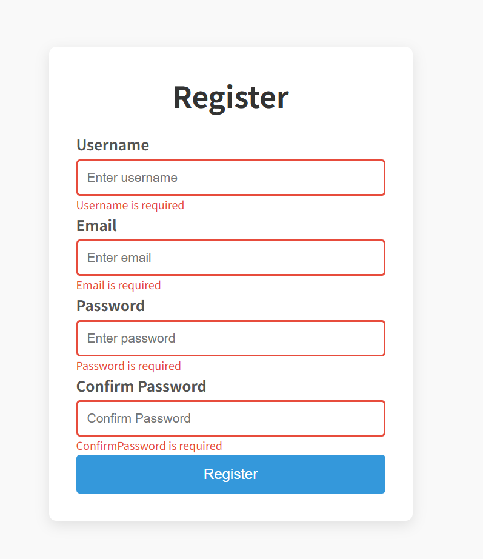

## html+css+js开发

#### 开发设置：

1、visual studio；

2、vs上安装live server插件；实时查看网页效果；

3、源文件：index.html, style.css, script.js;

4、一般的开发流程：index.html->style.css->script.js

5、参考开发手册：[面向开发者的 Web 技术 | MDN](https://developer.mozilla.org/zh-CN/docs/Web)


#### 项目1：注册表

最终效果图：



使用的html组件：

```hmtl
<div>, <form>, <h1>, <label>, <input>, <small>,<button>
```

常用的css属性：

- box-sizing: [box-sizing - CSS：层叠样式表 | MDN](https://developer.mozilla.org/zh-CN/docs/Web/CSS/box-sizing)
- margin：[margin - CSS：层叠样式表 | MDN](https://developer.mozilla.org/zh-CN/docs/Web/CSS/margin)
- padding：[padding - CSS：层叠样式表 | MDN](https://developer.mozilla.org/zh-CN/docs/Web/CSS/padding)
- align-items:[align-items - CSS：层叠样式表 | MDN](https://developer.mozilla.org/zh-CN/docs/Web/CSS/align-items)
- justify-content:[justify-content - CSS：层叠样式表 | MDN](https://developer.mozilla.org/zh-CN/docs/Web/CSS/justify-content)
- border/border-radius: 边线以及转角；
- backgroud-color: 背景色；

js的总体逻辑：

```js
1、获取各个input的值；
2、检查input值是否有空，未填写的；
3、检查input值是否合规；
4、如果全都后输入且合规，则显示注册成功信息；
```

主体代码如下：

```js
const form = document.getElementById("registration-form");
const username = document.getElementById("username");
const email = document.getElementById("email");
const password = document.getElementById("password");
const confirmPassword = document.getElementById("confirmPassword");

form.addEventListener("submit", function (e) {
  e.preventDefault();
  const isRequiredValid = checkRequired([username, email, password, confirmPassword]);
  let isFormValid = isRequiredValid;
  if (isRequiredValid) {
    const isUsernameValid = checkLength(username, 3, 15);
    const isEmailValid = checkEmail(email);
    const isPasswordValid = checkLength(password, 6, 25);
    const isPasswordsMatch = checkPasswordsMatch(password, confirmPassword);

    isFormValid = isUsernameValid && isEmailValid && isPasswordValid && isPasswordsMatch;
  }

  if (isFormValid) {
    alert("Registration successful!");
    form.reset();
    document.querySelectorAll(".form-group").forEach((group) => {
      group.className = "form-group";
    }); 
  }
});
```

js要做的检查；

```html
0、检查每个输入是否有输入值；
1、用户名的长度不能过短或者过长，要在3-15个字符之间；
2、email地址要有效；
3、密码不能过短或者过长，在6-15个字符之间；
4、密码与确认密码要一致；
```

其中的1和3可以使用统一的函数：

```js
function checkLength(input, min, max) {
  if (input.value.length < min) {
    showError(input, `${formatFieldName(input)} must be at least ${min} characters.`);
    return false;
  } else if (input.value.length > max) {
    showError(input, `${formatFieldName(input)} must be less than ${max} characters.`);
    return false;
  } else {
    showSuccess(input);
    return true;
  }
}

// Format field name with proper capitalization
function formatFieldName(input) {
  // input id: username -> Username
  return input.id.charAt(0).toUpperCase() + input.id.slice(1);
}
```

其中的2要使用正则表达式：

```js
function checkEmail(email) {
  const emailRegex = /^[^\s@]+@[^\s@]+\.[^\s@]+$/;
  if (emailRegex.test(email.value.trim())) {
    showSuccess(email);
    return true;
  } else {
    showError(email, "Email is not valid");
    return false;
  }
}
```

其中的4检测密码是否一致:

```js
function checkPasswordsMatch(input1, input2) {
  if (input1.value !== input2.value) {
    showError(input2, "Passwords do not match");
    return false;
  }
  return true;
}
```

其中的0是检查每个输入是否有输入值：

```js
function checkRequired(inputArray) {
  let isValid = true;

  inputArray.forEach((input) => {
    // Password is required
    if (input.value.trim() === "") {
      showError(input, `${formatFieldName(input)} is required`);
      isValid = false;
    } else {
      showSuccess(input);
    }
  });
  return isValid;
}
```

另外，如果正确或者出错需要展示对应的信息，即使用如下的两个函数：

```js
function showError(input, message) {
  const formGroup = input.parentElement;
  formGroup.className = "form-item error";
  const small = formGroup.querySelector("small");
  small.innerText = message;
}

function showSuccess(input) {
  const formGroup = input.parentElement;
  formGroup.className = "form-item success";
}
```
