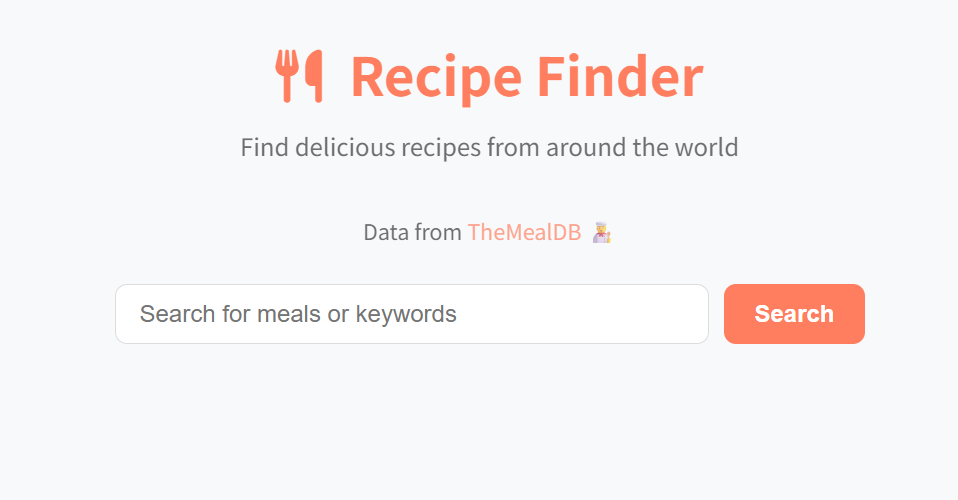

## html+css+js开发

#### 开发设置：

1、visual studio；

2、vs上安装live server插件；实时查看网页效果；

3、源文件：index.html, style.css, script.js;

4、一般的开发流程：index.html->style.css->script.js

5、参考开发手册：[面向开发者的 Web 技术 | MDN](https://developer.mozilla.org/zh-CN/docs/Web)


#### 项目5：利用第3方接口，实现菜单搜索与查看


**功能：**

- 实现菜单的搜索；
- 实现菜单内容的展示；

**初始状态：**



**设计问题：**

- api访问的跨域问题；

  ```html
  代码中使用的 TheMealDB API (https://www.themealdb.com/api/json/v1/1/) 已经正确配置了 CORS (跨域资源共享) 头部。这是通过 API 服务器返回的响应头中包含 Access-Control-Allow-Origin: * 来实现的，允许任何域名的前端应用访问该 API。
  ```

  

- 如何做到水平方向显示多个菜单项目：比如上图中，我们显示3个菜单项目；

  ```css
  .meals-container {
    display: grid; /*grid布局*/
    grid-template-columns: repeat(auto-fill, minmax(250px, 1fr)); /*自动填充*/
    gap: 1.5rem;
  }
  ```

**使用font-awesome:**

```js
        <link
          rel="stylesheet"
          href="https://cdnjs.cloudflare.com/ajax/libs/font-awesome/6.7.2/css/all.min.css"
          integrity="sha512-Evv84Mr4kqVGRNSgIGL/F/aIDqQb7xQ2vcrdIwxfjThSH8CSR7PBEakCr51Ck+w+/U6swU2Im1vVX0SVk9ABhg=="
          crossorigin="anonymous"
          referrerpolicy="no-referrer"
        />
```

**使用第三方接口：**

```html
https://www.themealdb.com/api.php
```


**为即时查看css效果而写在html中的数据：**

**菜单项数据：**

```html
<div class="meal" data-meal-id="52777">

          <div class="meal-info">
            <h3 class="meal-title">Mediterranean Pasta Salad</h3>
            <div class="meal-category">Seafood</div>
          </div>
        </div>
```

**菜单详情数据：**

```html
       <div class="meal-details-content">
           
           <h2 class="meal-details-title">Mediterranean Pasta Salad</h2>
           <div class="meal-details-category">
             <span>Seafood</span>
           </div>
           <div class="meal-details-instructions">
             <h3>Instructions</h3>
             <p>Bring a large saucepan of salted water to the boil
              Add the pasta, stir once and cook for about 10 minutes or as directed on the packet.Meanwhile, wash the tomatoes and cut into quarters. Slice the olives. Wash the basil.</p>
           </div>
           <div class="meal-details-ingredients">
             <h3>Ingredients</h3>
             <ul class="ingredients-list">  
                 <li><i class="fas fa-check-circle"></i> 200 g mozzarella balls</li>
                 <li><i class="fas fa-check-circle"></i> 250 g baby plum tomatoes</li>           
                 <li><i class="fas fa-check-circle"></i> 1  bunch fresh basil</li>     
                 <li><i class="fas fa-check-circle"></i> 350 g farfalle</li>       
                 <li><i class="fas fa-check-circle"></i> 3  tablespoons extra virgin olive oil</li>          
                 <li><i class="fas fa-check-circle"></i> 40 g Green Olives</li>          
                 <li><i class="fas fa-check-circle"></i> 200 g tuna</li>            
                 <li><i class="fas fa-check-circle"></i> to taste salt</li>            
                 <li><i class="fas fa-check-circle"></i> to taste pepper</li>            
             </ul>
           </div>
             <a href="https://www.youtube.com/watch?v=e52IL8zYmaE" target="_blank" class="youtube-link">
               <i class="fab fa-youtube"></i> Watch Video
             </a>
         </div>
```


**css部分：**

```css
* {
  margin: 0;
  padding: 0;
  box-sizing: border-box;
}

:root {
  --primary: #ff7e5f;
  --primary-dark: #eb5e41;
  --primary-light: #ffb199;
  --secondary: #0ba360;
  --text-dark: #333333;
  --text-light: #f8f9fa;
  --background: #ffffff;
  --background-light: #f8f9fa;
  --card-bg: #ffffff;
  --border-radius: 8px;
  --shadow: 0 2px 4px rgba(0, 0, 0, 0.1);
  --transition: all 0.3s ease;
}
```


**js部分：**

初始化部分：

```js
const searchInput = document.getElementById("search-input");
const searchBtn = document.getElementById("search-btn");
const mealsContainer = document.getElementById("meals");
const resultHeading = document.getElementById("result-heading");
const errorContainer = document.getElementById("error-container");
const mealDetails = document.getElementById("meal-details");
const mealDetailsContent = document.querySelector(".meal-details-content");
const backBtn = document.getElementById("back-btn");
```

两个接口：

```js
https://www.themealdb.com/api.php
两个接口：
const BASE_URL = "https://www.themealdb.com/api/json/v1/1/";
const SEARCH_URL = `${BASE_URL}search.php?s=`; //根据菜名，搜菜单；
const LOOKUP_URL = `${BASE_URL}lookup.php?i=`; //根据菜名id，搜菜谱详情；
```

三个事件：

1、点击搜索按钮；

2、点击菜单项目；

3、点击返回按钮；

```js
searchBtn.addEventListener("click", searchMeals);
searchInput.addEventListener("keypress", (e) => {
  if (e.key === "Enter") searchMeals();
});
mealsContainer.addEventListener("click", handleMealClick);
backBtn.addEventListener("click", () => mealDetails.classList.add("hidden"));
```

搜索菜单的方法：

```js
async function searchMeals() {
  const searchTerm = searchInput.value.trim();
  // handled the edge case
  if (!searchTerm) {
    errorContainer.textContent = "Please enter a search term";
    errorContainer.classList.remove("hidden");
    return;
  }
  try {
    resultHeading.textContent = `Searching for "${searchTerm}"...`;
    mealsContainer.innerHTML = "";
    errorContainer.classList.add("hidden");

    // fetch meals from API
    // www.themealdb.com/api/json/v1/1/search.php?s=chicken
    const response = await fetch(`${SEARCH_URL}${searchTerm}`);
    const data = await response.json();

    if (data.meals === null) {
      // no meals found
      resultHeading.textContent = ``;
      mealsContainer.innerHTML = "";
      errorContainer.textContent = `No recipes found for "${searchTerm}". Try another search term!`;
      errorContainer.classList.remove("hidden");
    } else {
      resultHeading.textContent = `Search results for "${searchTerm}":`;
      displayMeals(data.meals);
      searchInput.value = "";
    }
  } catch (error) {
    errorContainer.textContent = "Something went wrong. Please try again later.";
    errorContainer.classList.remove("hidden");
  }
}
```

此处使用async异步函数声明词，该关键词的主要作用：

- 声明该函数是异步的，允许在函数内使用 `await`。
- 自动将函数返回值包装成 Promise（即使没有显式返回 Promise）。

searchMeals` 函数需要等待 `fetch` 请求完成并解析响应数据。

```js
async function searchMeals() {
  const searchTerm = searchInput.value.trim();
  
  try {
    // 异步请求：fetch API 返回 Promise
    const response = await fetch(`${SEARCH_URL}${searchTerm}`);
    const data = await response.json(); // 异步解析 JSON

    if (data.meals === null) {
      // 处理无结果的情况
    } else {
      displayMeals(data.meals); // 渲染数据
    }
  } catch (error) {
    // 处理错误
  }
}
```

获取到网络数据，渲染与展示数据的displayMeals函数：

```js
function displayMeals(meals) {
  mealsContainer.innerHTML = "";
  // loop through meals and create a card for each meal
  meals.forEach((meal) => {
    mealsContainer.innerHTML += `
      <div class="meal" data-meal-id="${meal.idMeal}">
        
        <div class="meal-info">
          <h3 class="meal-title">${meal.strMeal}</h3>
          ${meal.strCategory ? `<div class="meal-category">${meal.strCategory}</div>` : ""}
        </div>
      </div>
    `;
  });
}
```

每一个菜单项，添加点击看详情的事件函数：

```js
async function handleMealClick(e) {
  const mealEl = e.target.closest(".meal");
  if (!mealEl) return;

  const mealId = mealEl.getAttribute("data-meal-id");

  try {
    const response = await fetch(`${LOOKUP_URL}${mealId}`);
    const data = await response.json();

    if (data.meals && data.meals[0]) {
      const meal = data.meals[0];

      const ingredients = [];

      for (let i = 1; i <= 20; i++) {
        if (meal[`strIngredient${i}`] && meal[`strIngredient${i}`].trim() !== "") {
          ingredients.push({
            ingredient: meal[`strIngredient${i}`],
            measure: meal[`strMeasure${i}`],
          });
        }
      }

      // display meal details
      mealDetailsContent.innerHTML = `
           
           <h2 class="meal-details-title">${meal.strMeal}</h2>
           <div class="meal-details-category">
             <span>${meal.strCategory || "Uncategorized"}</span>
           </div>
           <div class="meal-details-instructions">
             <h3>Instructions</h3>
             <p>${meal.strInstructions}</p>
           </div>
           <div class="meal-details-ingredients">
             <h3>Ingredients</h3>
             <ul class="ingredients-list">
               ${ingredients
                 .map(
                   (item) => `
                 <li><i class="fas fa-check-circle"></i> ${item.measure} ${item.ingredient}</li>
               `
                 )
                 .join("")}
             </ul>
           </div>
           ${
             meal.strYoutube
               ? `
             <a href="${meal.strYoutube}" target="_blank" class="youtube-link">
               <i class="fab fa-youtube"></i> Watch Video
             </a>
           `
               : ""
           }
         `;
      mealDetails.classList.remove("hidden");
      mealDetails.scrollIntoView({ behavior: "smooth" });
    }
  } catch (error) {
    errorContainer.textContent = "Could not load recipe details. Please try again later.";
    errorContainer.classList.remove("hidden");
  }
}
```


**后续的扩展：**

将最近一次的搜索结果保存到本地的local-storage；
