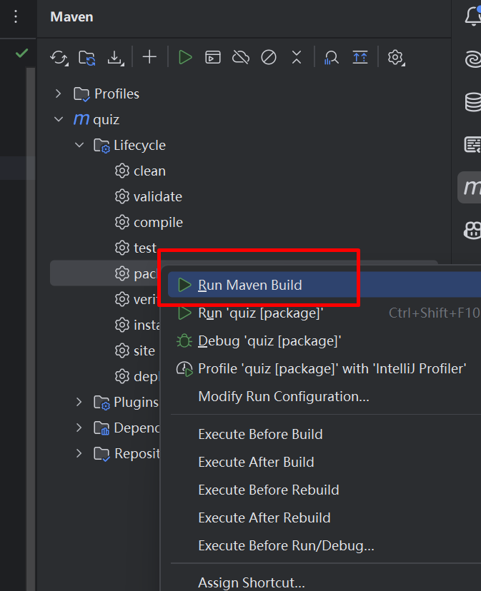
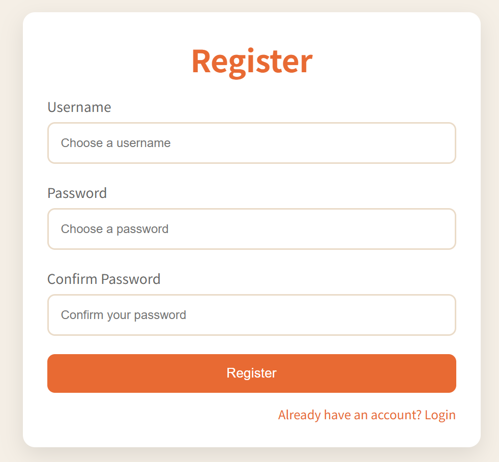

### 前后端的部署

##### 1、管理前端的打包

1、前端运行build命令：

```javascript
npm run build
```

如果一切顺利，则会在当前目录下打包生成dist目录。

如果想在本地测试dist目录下的文件，则需要按如下：

```javascript
//安装serve包;
npm install -g serve

//使用serve运行dist目录中的文件；
npx serve -s dist
//如果希望指定端口号，则使用如下的更具体的命令;
npx serve -s dist -l 8081 //使用8081端口；
```

后续只要将dist目录下的所有内容复制粘贴到服务器目录即可。

2、Ubuntu服务器上安装nginx，配置如下：

```bash
server {
    ##监听8081端口
    listen 8081;
    ##服务器名
    server_name localhost;
    ##网页根目录
    root /var/www/html;

    # Add index.php to the list if you are using PHP
    index index.html index.htm index.nginx-debian.html;

    location / {
        # First attempt to serve request as file, then
        # as directory, then fall back to displaying a 404.
        try_files $uri $uri/ =404;
    }
}
```

将dist目录下的内容复制粘贴到/var/www/html目录下；


##### 2、后端的部署：

后端部署主要分为两个步骤：

- 1、将java代码打包为jar包；
- 2、迁移数据库；

1、将java代码打包之前要注意的是：开发环境下的application.yml可能会涉及部分敏感账户信息，我们在打包时，可以先不将其打包在内；如何配置？

```xml
<!-- 可以在 pom.xml 的 <build> 配置中，使用 <resources> 标签排除 application.yml 文件。这样打包时不会将项目根目录下的 application.yml 文件打进 jar 包。-->
<build>
    <resources>
        <resource>
            <directory>src/main/resources</directory>
            <excludes>
                <exclude>application.yml</exclude>
            </excludes>
        </resource>
    </resources>
</build>
```

2、点击IDEA右侧的maven->package->Run Maven Build：



运行以后，当前项目下会出现target目录，其中会有一个quiz-0.0.1-SNAPSHOT.jar的jar包，最终要部署的就是这个jar包：


3、迁移数据库：

使用mysqldump导出数据库：

```mysql
mysqldump -u root -p --databases quiz > quiz.sql
```

如果出现如下的错误：


需要找到mysql的安装目录的/bin/下的mysqldump.exe程序；


出现拒绝访问的问题；以管理员方式打开cmd;


以root账号登录服务器上的mysql，创建quiz数据库，并创新一个新的用户，比如test，将quiz的全部权限赋予test用户(尽量不要直接使用root账户)：

```mysql
#使用root账户登录；
mysql -u root -p
#创建quiz数据库；
create database quiz;
##创建一个test普通用户；
create user 'testme' identified by '12345';
##赋予test用户操作quiz数据库的所有权限
grant all privileges on quiz.* to testme identified by "12345";
##退出mysql账户后，以test用户导入quiz.sql；
mysql -u test -p quiz < quiz.sql
```

4、完成jar包的配置文件：

在jar包的当前目录下，创建application.yml配置文件：

```xml
spring:
  datasource:
    driver-class-name: com.mysql.cj.jdbc.Driver
    url: jdbc:mysql://localhost:3306/quiz
    username: testme
    password: 12345

server:
  port: 8080
  address: localhost
```

注意：server要与spring同级。

当前ubuntu下安装17+的openjdk，然后运行如下命令：

```bash
nohup java -jar quiz-0.0.1-SNAPSHOT.jar > app.log 2>&1 &
```

- nohup：忽略挂断信号，保证程序在用户退出后继续运行。
- java -jar quiz-0.0.1-SNAPSHOT.jar：运行名为 quiz-0.0.1-SNAPSHOT.jar 的 Java 可执行包。

- app.log：将标准输出（如 System.out）重定向到 app.log 文件。
- 2>&1：将标准错误输出（如异常信息）也重定向到标准输出（即 app.log）。
- &：让命令在后台运行，终端可继续执行其他操作。

##### 3、用户前端的部署

基于之前的quiz代码，利用ai完成，因为要复用之前的代码，所以采用纯粹的html+css+js来实现；

login页面和注册页面；用户前端使用的接口：

- login;
- register；
- getQuestion；

涉及到的主要逻辑：

```html
1、login获取到jwt-token，并保存到本地;
2、getQuestion接口根据jwt-token，来向后端请求数据;
3、register注册新用户，注意isRole默认为零;
```

**login**

将我们之前书写的quiz(原生的html+css+js)上传大语言模型，根据如下的提示词让其书写 login的代码：

```bash
请参照quiz的样式，书写一个login网页，网页中包含html+css+js，login页的右下角包含一register页面跳转；
```

再参照后端访问页面，让ai完成基于axios访问后端的页面：

```bash
 ##提示语：
请基于axios库实现对后端登录页面的实现，下面是后端接口代码，如果后端传回的json数据中，code值为1，则说明登录成功，将后端传回的data作为token保存到本地；然后，login页面跳转到前端的quiz页面；如果后端传回的json数据中，code值为0，则提示用户登录不成功。
         @PostMapping("/login")
        public Result login(@RequestBody Map<String, String> loginData){
            String username = loginData.get("username");
            String password = loginData.get("password");

            if (StringUtils.isAnyBlank(username, password)) {
                return Result.error("用户名或密码为空");
            }
            User userResult = userService.login(username, password);
            if(userResult!=null){
                Claims claims = Jwts.claims();
                claims.put("id", userResult.getId());
                claims.put("username", userResult.getUserName());

                String token = JwtUtil.generateTokenWithClaims(claims);
                Result result = Result.success("用户登录成功");
                result.setData(token);
                return result;
            }else{
                return Result.error("用户登录失败");
            }
        }
```

根据如上的提示语，github copilot提供我们的代码：

```javascript
    <script src="https://cdn.jsdelivr.net/npm/axios/dist/axios.min.js"></script>
    <script>
      document.getElementById('login-btn').addEventListener('click', function() {
        const username = document.getElementById('username').value;
        const password = document.getElementById('password').value;

        if (!username || !password) {
          alert('请填写所有字段');
          return;
        }

        axios.post('http:/localhsot:8080/login', {
          username: username,
          password: password
        })
        .then(function(response) {
          const res = response.data;
          if (res.code === 1) {
            // 登录成功，保存token并跳转
            localStorage.setItem('token', res.data);
            window.location.href = 'quiz.html';
          } else {
            // 登录失败，提示用户
            alert(res.msg || '登录失败');
          }
        })
        .catch(function(error) {
          alert('请求失败，请稍后重试');
          console.error(error);
        });
      });
    </script>
```

**quiz：**

由login页面我们跳转到quiz页面：


当用户点击Start Quiz按钮后，前端基于axios向后端发起getQuestion的数据请求；

```bash
#提示语如下：
当用户点击Start Quiz按钮后，网页基于axios向后端提起数据访问请求，前端向后端访问数据时，需要带上login阶段的token令牌，并且由于跨域访问的原因，需要添加withCredential的关键词,后端提供数据的接口与实体类如下,收到来自后端的json数据后，要赋值给quizQuestions，请书写quiz中相应代码实现上述功能。
    @GetMapping("/getQuestion")
    public Result getQuestion() {
        List<QSBeanOut> qsBeanOutList = questionService.getQuestions();
        return Result.success(qsBeanOutList);
    }
public class QSBeanOut {
    private String question;
    private List<AnsBean> answers;
    ...
}
public class AnsBean {
    private String text;
    private boolean correct;
    ...
}   
```

根据上述的提示，获取的相关代码如下：

```javascript
<script src="https://cdn.jsdelivr.net/npm/axios/dist/axios.min.js"></script>
<script>
    let quizQuestions = []; // 初始化为空数组
    startButton.addEventListener("click", fetchQuestionsAndStart);

    function fetchQuestionsAndStart() {
      const token = localStorage.getItem('token');
      if (!token) {
        alert('请先登录');
        window.location.href = 'login.html';
        return;
      }

      axios.get('/getQuestion', {
        headers: {
          'token': token
        },
        withCredentials: true
      })
      .then(function(response) {
        const res = response.data;
        if (res.code === 1 && Array.isArray(res.data)) {
          quizQuestions = res.data;
          totalQuestionsSpan.textContent = quizQuestions.length;
          maxScoreSpan.textContent = quizQuestions.length;
          startQuiz();
        } else {
          alert(res.msg || '获取题目失败');
        }
      })
      .catch(function(error) {
        alert('请求题目失败，请稍后重试');
        console.error(error);
      });
    }
</script>
```


**register：**



**注册页面：**

因为没有account，用户才需要注册账户，所以用户前端要调用register接口，<font color=red>但是与后端Java矛盾，后端java要先登录获得Jwt令牌，才能调用register接口，否则会被filter。</font>


**如何纠正？**

- 将/register接口供用户端专用；
- 新建/adduser接口供管理端前端使用；
- 前端管理端的添加用户接口对应修改；
- /register与/adduser调用后端同样的service层接口，但是/register调用时，isRole属性只能是用户普通账户；/adduser调用时，isRole属性由前端传入(可以是管理员，也可以是普通用户)
- 在Filter类，要对/register接口放行；


**步骤1：修改后端接口**

controller层的修改：

```java
        @PostMapping("/register")
//      public Result addUser(String username, String password, String checkpassword)
        public Result register(@RequestBody Map<String, String> registerData){
            String username = registerData.get("username");
            String password = registerData.get("password");
            String checkpassword = registerData.get("checkpassword");

            if (StringUtils.isAnyBlank(username, password, checkpassword)) {
                return Result.error("用户名或密码为空");
            }
            final String role = "0";  //普通用户;
            Result result = userService.saveUser(username, password, checkpassword,role);
            return result;
        }

        @PostMapping("/addUser")
        //public Result addUser(String username, String password, String checkpassword)
        public Result addUser(@RequestBody Map<String, String> userData){
            String username = userData.get("username");
            String password = userData.get("password");
            String checkpassword = userData.get("checkpassword");
            String role = userData.get("userrole");
            
            if (StringUtils.isAnyBlank(username, password, checkpassword, role)) {
                return Result.error("用户名或密码为空");
            }
            Result result = userService.saveUser(username, password, checkpassword,role);
            return result;
        }
```

对管理端：role这个元素来源于前端，也就是管理员要指定新增的用户是普通用户，还是管理员。

<font color=red>注意：管理员前端的“添加用户"模块，还需要增加用户类型选项；</font>

无论是管理端，还是用户端，都调用：

```java
Result result = userService.saveUser(username, password, checkpassword,role);
//用户端，类型固定：
final String role = "0";  //普通用户;
//管理端，类型来源于前端：
String role = userData.get("userrole"); //普通用户 or 管理员用户
```

service层的修改：

```java
//接口的修改：
public Result saveUser(String username, String password, String checkpassword, String role);
//实现类的修改：
    public Result saveUser(String username, String password, String checkpassword, String role){
    ....
    user.setUserRole(Integer.parseInt(role));
    ...
    }
```

**步骤2：管理端前端的修改**

```bash
管理端前端->用户->添加用户
```


在"确认密码"下方，再添加一关于"普通用户"和"管理员"的option。

**步骤3：Filter类对register放行**

```java
//2、判断url中是否包含login或register，如果包含，则说明是登录或注册操作，放行；
        if(url.contains("login") || url.contains("register")){
            chain.doFilter(req, res);
            return;
        }
```


用户前端的修改：

```bash
##提示语：
请基于axios库实现用户的注册，下面是后端接口代码，如果后端传回的json数据中，code值为1，则说明注册成功，一旦注册成功，则跳转到前端的login页面；如果后端传回的json数据中，code值为0，则提示用户注册不成功，请显示回传数据中的msg信息，从而告知用户不成功的原因，请在当前的register页面，添加相关代码。下面是后端的注册接口代码：
        @PostMapping("/register")
        public Result addUser(@RequestBody Map<String, String> registerData){
            String username = registerData.get("username");
            String password = registerData.get("password");
            String checkpassword = registerData.get("checkpassword");
            if (StringUtils.isAnyBlank(username, password, checkpassword)) {
                return Result.error("用户名或密码为空");
            }
            Result result = userService.saveUser(username, password, checkpassword);
            return result;
        }
```

对应的代码：

```javascript
<script src="https://cdn.jsdelivr.net/npm/axios/dist/axios.min.js"></script>
<script>
  document.getElementById('register-btn').addEventListener('click', function() {
    const username = document.getElementById('username').value;
    const password = document.getElementById('password').value;
    const confirmPassword = document.getElementById('confirm-password').value;

    // Reset error messages
    document.getElementById('username-error').style.display = 'none';
    document.getElementById('password-error').style.display = 'none';
    document.getElementById('confirm-error').style.display = 'none';

    let isValid = true;

    // Validation
    if (!username) {
      document.getElementById('username-error').style.display = 'block';
      isValid = false;
    }

    if (!password) {
      document.getElementById('password-error').style.display = 'block';
      isValid = false;
    }

    if (password !== confirmPassword) {
      document.getElementById('confirm-error').style.display = 'block';
      isValid = false;
    }

    if (!isValid) return;

    // 使用axios发送注册请求
    axios.post('http:/localhost:8080/register', {
      username: username,
      password: password,
      checkpassword: confirmPassword
    })
    .then(function(response) {
      const res = response.data;
      if (res.code === 1) {
        alert('注册成功！请登录。');
        window.location.href = 'login.html';
      } else {
        alert(res.msg || '注册失败');
      }
    })
    .catch(function(error) {
      alert('请求失败，请稍后重试');
      console.error(error);
    });
  });
</script>
```


**后续的完善：**

1、用户前端的注册用户页，要与管理前端的添加用户页面相区别；

- 管理前端添加用户，要选择普通用户  or  管理员；
- 用户前端只能注册普通用户；
- 普通用户的账户，不能登录管理前端；

2、当前的java后端直接对接来自前端的api访问，不利于后续配置https和负载均衡；建议采用Nginx作为java后端的反向代理；

3、对后端java增加全局异常类处理代码，并且将异常信息log日志输出；
