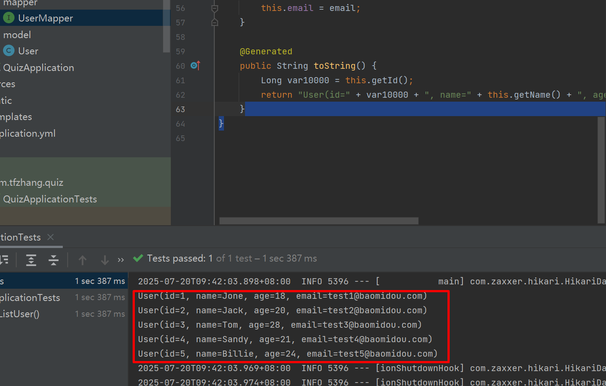

### Quiz后端-1、spring项目初始化与数据库设置

###### 日期：2025.07.19   作者：tfzhang

后端主要提供用户与题目的注册、查询、删除等操作。使用到的开发工具：

- IDEA2024; 关注公众号”青椒工具”，发送”IDEA”，获取windows下的IDEA安装包
- mysql 5.7；关注公众号”青椒工具”，发送”mysql”，获取windows下的mysql5.7安装包；


后端采用java实现，项目采用spring初始化，并进行数据库设计。数据库采用mysql，涉及到后端技术栈：

- java
- spring
- springmvc
- mybatis：一款优秀的持久层框架，用于简化JDBC的开发；


- springboot


这些工具都可以在spring初始化时安装。

本项目使用mysql数据库，所以我们要先安装mysql数据库，其安装过程及资源可参考如下的视频：

```html
https://www.bilibili.com/video/BV1Ra4y1y7Hs/?spm_id_from=333.999.0.0&vd_source=b0e6d0da66db457c6afda440766d8139
```

为了让Maven管理器，下载包更快，可以将当前系统中的maven包源地址设置为阿里云镜像：

```xml
<mirrors>
    <mirror>
        <id>aliyun</id>
        <name>Aliyun Maven Mirror</name>
        <url>https://maven.aliyun.com/repository/public</url>
        <mirrorOf>central</mirrorOf>
    </mirror>
</mirrors>
```

具体地，在Windows: `C:\Users\你的用户名\.m2\settings.xml`文件中，输入上述内容。

关于Maven的详情，可以参考：[Day04-01. maven-课程介绍_哔哩哔哩_bilibili](https://www.bilibili.com/video/BV1m84y1w7Tb?spm_id_from=333.788.videopod.episodes&vd_source=b0e6d0da66db457c6afda440766d8139&p=50)


##### 1、spring初始化

直接在IDEA开发工具进行初始化，


<center>图1 spring项目初始化</center>

此处值得注意的是Project SDK是选择jdk版本，你选择好后，IDEA会自动帮你下载安装，不需要自己额外到系统中安装java jdk。


<center>图2 spring boot需要安装的依赖</center>

这些依赖，可以通过左上角的"搜索框"查找，添加。简单介绍下：

- Lombok：自动添加get和set方法；

- Mysql Driver：链接数据库的驱动；

- Spring web: 支持网络访问接口；

- MyBatis Framework：操作数据库；

  

点击Finish后，IDEA会自动去下载需要的依赖包，需要一定的时间，完成下载后如图3所示。


<center>图3 点击右侧的maven展示依赖包</center>

图4是IDEA初始化后的项目目录，简单扼要介绍下：

- src: 主要存放源代码， main是业务代码，test是测试代码；
- pom.xml: 依赖包的配置文件，如果要增加新的依赖包，可以在该文件中配置； 


<center>图4 IDEA初始化的项目文件</center>

##### 2、连接数据库及数据库设计

完成数据库安装后，我们使用IDEA连接数据库，并初始化数据库。


<center>图5 IDEA连接mysql数据库</center>

填写数据库用户和密码，登录数据库，图6所示：


<center>图6 填写数据库账户名和密码</center>

数据库的root用户和密码是你在安装mysql数据库是设定的，另外，由于是本地数据库，所以URL地址默认是：

```bash
jdbc:mysql://localhost:3306
```

鼠标选中mysql的localhost，new->schema，创建名为quiz的数据库：


<center>图7 创建数据库</center>

##### 3、MyBatis操作数据库：

**步骤1：创建示例数据库**

快速地创建一个mytest数据库，然后参照文档创建user表，并插入数据；

```sql
DROP TABLE IF EXISTS `user`;

CREATE TABLE `user`
(
    id BIGINT NOT NULL COMMENT '主键ID',
    name VARCHAR(30) NULL DEFAULT NULL COMMENT '姓名',
    age INT NULL DEFAULT NULL COMMENT '年龄',
    email VARCHAR(50) NULL DEFAULT NULL COMMENT '邮箱',
    PRIMARY KEY (id)
);

DELETE FROM `user`;

INSERT INTO `user` (id, name, age, email) VALUES
(1, 'Jone', 18, 'test1@baomidou.com'),
(2, 'Jack', 20, 'test2@baomidou.com'),
(3, 'Tom', 28, 'test3@baomidou.com'),
(4, 'Sandy', 21, 'test4@baomidou.com'),
(5, 'Billie', 24, 'test5@baomidou.com');
```

**步骤2：创建数据库对应的实体类**

在com.tfzhang.quiz目录下创建model目录，其中添加User.java文件，并输入文档中的内容：

```java
package com.tfzhang.quiz.model;

import lombok.Data;

@Data
public class User {
    private Long id;
    private String name;
    private Integer age;
    private String email;
}
```

##### 步骤3：创建MyBatis配置文件

将项目中的application.properites配置修改为application.yml，即只改后缀，主要原因是yml后缀的配置文件书写更灵活；参照mybatis文档，书写配置文件：

```yml
spring:
  application:
    name:quiz
  datasource:
    driver-class-name: com.mysql.cj.jdbc.Driver
    url: jdbc:mysql://localhost:3306/mytest
    username: root
    password: 123456
server:
  port: 8080
```

注意：数据库采用我们为本次测试创建的mytest据库；

##### 步骤4：编写SQL语句

在com.tfzhang.quiz目录下创建mapper目录，创建UserMapper这个接口；

```java
package com.tfzhang.quiz.mapper;

import com.tfzhang.quiz.model.User;
import org.apache.ibatis.annotations.Mapper;
import org.apache.ibatis.annotations.Select;

import java.util.List;

@Mapper //运行时，框架会自动实现实现类对象，并将对象实例交由IoC容器管理；
public interface UserMapper{

    //查询全部用户；
    @Select("select * from user")
    public List<User> list();
}
```

需要注意的问题：

- 这里我们只需要定义interface，不需要写实现类；因为使用了Mapper标签；
- list()方法与sql语句的“select * from user"绑定；通过@Select标签；


**步骤5：编写测试类**

将我们的测试list()的代码写在test.com.tfzhang.quiz.QuizApplicationTests.java中；

标签@Autowired，使用的是依赖注入的概念，具体参见：[Day05-10. 分层解耦-分层解耦(IOC-DI引入)_哔哩哔哩_bilibili](https://www.bilibili.com/video/BV1m84y1w7Tb?spm_id_from=333.788.videopod.episodes&vd_source=b0e6d0da66db457c6afda440766d8139&p=76)

```java
package com.tfzhang.quiz;

import com.tfzhang.quiz.mapper.UserMapper;
import com.tfzhang.quiz.model.User;
import org.junit.jupiter.api.Test;
import org.springframework.beans.factory.annotation.Autowired;
import org.springframework.boot.test.context.SpringBootTest;

import java.util.List;

@SpringBootTest
class QuizApplicationTests {

    @Autowired  //依赖注入；
    private UserMapper userMapper;

    @Test
    public void testListUser(){
        List<User> userList = userMapper.list();
        userList.forEach(user->{
            System.out.println(user);
        });
    }
}
```



运行测试类后，可以在终端看到5个数据的输出。至此，MyBatis的测试成功。
