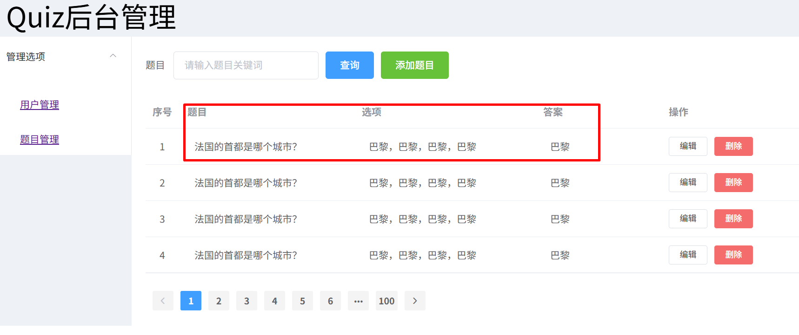

### Quiz后端-7、实现题目页的删除与查询

###### 日期：2025.07.24   作者：tfzhang

后端主要提供用户与题目的注册、查询、删除等操作。使用到的开发工具：

- IDEA2024; 关注公众号”青椒工具”，发送”IDEA”，获取windows下的IDEA安装包
- mysql 5.7；关注公众号”青椒工具”，发送”mysql”，获取windows下的mysql5.7安装包；


#### 1、题目的删除；

- 根据id删除题目；
- 主要采用逻辑删除的方式；

参考删除用户的代码来实现。


**步骤1：questionmapper中添加删除方法**

在QuestionMapper中添加如下的代码：

```java
    //根据id删除题目；
	@Update("UPDATE questions SET isDelete = 1 WHERE id = #{id} AND isDelete = 0")
    public int delQuestionById(Integer id);
```

**步骤2：测试QuestionMapper方法**

测试上述的删除方法。

**步骤3：在QuestionService中添加接口及方法**

```java
//接口；
public boolean delQuestion(Integer id)；
    
//实现；
public boolean delQuestion(Integer id){
    int result = questionMapper.delQuestionById(id);
    return result>0;
}
```

**步骤4：controller中添加代码**

```java
    @GetMapping ("/delQuestion")
    public Result deleteQuestion(Integer id) {
        boolean success = questionService.delQuestion(id);
        if (success) {
            return Result.success("用户成功删除");
        }
        return Result.error("用户不存在或已被删除");
    }
```

**步骤5：在apifox中测试**


#### 2、题目的查询；

题目的查询来自用户端和管理端，为了作为区分：

用户端的查询称为：获取题目；

管理端的查询称为：查询题目；其中管理端的查询与用户查询类似，分为：

- 分页查询与按关键词查询；


**用户端获取题目的实体类：**

用户端需要的数据格式：

```json
const quizQuestions = [
  {
    question: "What is the capital of France?",
    answers: [
      { text: "London", correct: false },
      { text: "Berlin", correct: false },
      { text: "Paris", correct: true },
      { text: "Madrid", correct: false },
    ],
  },
  {
    question: "Which planet is known as the Red Planet?",
    answers: [
      { text: "Venus", correct: false },
      { text: "Mars", correct: true },
      { text: "Jupiter", correct: false },
      { text: "Saturn", correct: false },
    ],
  }
]
```

根据上述用户端的数据格式，创建实体类QSBeanOut:

```java
public class QSBeanOut{
    private String question;
    private List<AnsBean> answers;
    //setter.getter.
}
```

再创建AnsBean类：

```java
public class AnsBean{
    private String text;
    private boolean correct;
    //类构造方法；
    public AnsBean(String text, boolean correct) {
        this.text = text;
        this.correct = correct;
    }
    //setter.getter.
}
```

**获取题目的QuestionMapper：**

用户每次获取题目的数量是固定的，就是5个题目；

对应的sql语句如下：

```sql
SELECT * FROM questions ORDER BY RAND() LIMIT 5;
```

对应的代码：

```java
@Mapper
public interface QuestionMapper {
    @Select("SELECT * FROM questions where isDelete=0 ORDER BY RAND() LIMIT 5")
    public List<Question> getQuestions();
}
```

**测试getQuestions方法**

```java
    @Test
    public void testQuestionList(){
        List<Question> qlist = questionMapper.getQuestions();
        for (Question q : qlist) {
            System.out.println(q);
        }
    }
```

**Controller层创建方法：**

```java
    @GetMapping("/getQuestion")
    public Result getQuestion() {
        List <QSBeanOut> qsBeanOut = questionService.getQuestions();
        return Result.success(qsBeanOut);
    }
```

此处返回的对象是QSBeanOut的List，但是在mapper层返回的是Question类型的list，所以此处我们需要作一个转换，我们在创建utils目录，并在其中撰写转换的工具方法；

```java
public static List<QSBeanOut> convertToQSBeanList(List<Question> questionList) {
    List<QSBeanOut> result = new ArrayList<>();
    
    for (Question question : questionList) {
        QSBeanOut qsBean = new QSBeanOut();
        qsBean.setQuestion(question.getQuestionText());
        
        List<AnsBean> answers = new ArrayList<>();
        answers.add(new AnsBean(question.getAnswer1Text(), question.getAnswer1Correct()));
        answers.add(new AnsBean(question.getAnswer2Text(), question.getAnswer2Correct()));
        answers.add(new AnsBean(question.getAnswer3Text(), question.getAnswer3Correct()));
        answers.add(new AnsBean(question.getAnswer4Text(), question.getAnswer4Correct()));
        
        qsBean.setAnswers(answers);
        result.add(qsBean);
    }
    return result;
}
```

**Service层的接口与代码**

```java
//interface:
    //获取5个新问题；
    public List<QSBeanOut> getQuestions();

//impl
    public List<QSBeanOut> getQuestions(){
        //获取question list;
        List<Question> questionList = questionMapper.getQuestions();
        //将question list转化为QSBeanOut;
        List<QSBeanOut> qsBeanOutList = Tools.convertToQSBeanList(questionList);
        return qsBeanOutList;
    }
```

**apifox端测试**


#### 3、管理端的查询

管理端的题目查询与用户的查询比较一致，因此可以参考用户的查询：

- 分页查询
- 按题目的关键词查询；

首先要观察管理端的前端页面，来确定实体类：



分页和按题目关键词查询的题目都包含三个部分：

- 题目；
- 选项；
- 答案；

对应的数据接口：

```json
{
    questionText:"题目内容"，
    options:{"a","b","c","d"},
	answer:"b"
}
```

在model目录中，创建相应的类：

```java
public class QSBeanPage{
    private int total;
    private List<QSBeanOutManage> qsBeanList;
}

public class QSBeanOutManage {
    private String questionText;
    private List<String> options;
    private String answer;
}
```

**步骤2：questionmapper中添加代码**

```java
@Select("SELECT COUNT(*) FROM questions WHERE isDelete=0")
public int count();

@Select("SELECT * FROM questions WHERE isDelete=0 limit #{start},#{pageSize}")
public List<Question> page(Integer start, Integer pageSize);
```


**步骤3：QuestionController中添加代码**

```java
@GetMapping("/questions")
public Result getPage(@RequestParam(defaultValue="1")Integer page, @RequestParam(defaultValue="5")Integer pageSize){
    QSBeanPage qsBeanPage=questionService.page(page, pageSize);
    return Result.success(qsBeanPage);
}
```

**步骤4：Question Service层中添加代码**

```java
//接口：
public QSBeanPage page(Integer page, Integer pageSize);

//实现：
public QSBeanPage page(Integer page, Integer pageSize){
    //获取总的记录数；
    Integer total=questionMapper.count();
    
    //获取分页查询结果列表；
    Integer start = (page-1)*pageSize;
    List<Question> questionList=questionMapper.page(start, pageSize);
    
    //将questionList转化为QSBeanOutManage
    //to be done;
    QSBeanOutManage qsBeanOutManage = Tools.convertToQSBeanManageList(questionList);
    
    //封装PageBean对象；
    QSBeanPage qsBeanPage = new QSBeanPage();
    qsBeanPage.setTotal(total);
    qsBeanPage.setQsBeanList(qsBeanOutManage);
    	
    return qsBeanPage;
}
```

其中的Tools.convertToQSBeanManageList是定义在utils中的工具类：

```java
    public static List<QSBeanOutManage> convertToQSBeanManageList(List<Question> questionList) {
        List<QSBeanOutManage> result = new ArrayList<>();
        if (questionList == null) {
            return result;
        }

        for (Question question : questionList) {
            // 跳过已删除的问题
            if (question.getIsDelete() != null && question.getIsDelete() == 1) {
                continue;
            }

            QSBeanOutManage bean = new QSBeanOutManage();
            bean.setQuestionText(question.getQuestionText());

            // 构建选项列表（固定4个选项）
            List<String> options = new ArrayList<>(4);
            options.add(question.getAnswer1Text() != null ? question.getAnswer1Text() : "");
            options.add(question.getAnswer2Text() != null ? question.getAnswer2Text() : "");
            options.add(question.getAnswer3Text() != null ? question.getAnswer3Text() : "");
            options.add(question.getAnswer4Text() != null ? question.getAnswer4Text() : "");
            bean.setOptions(options);

            // 查找正确答案文本
            bean.setAnswer(determineCorrectAnswer(question));
            result.add(bean);
        }

        return result;
    }

    private static String determineCorrectAnswer(Question question) {
        if (question.getAnswer1Correct() != null && question.getAnswer1Correct()) {
            return question.getAnswer1Text() != null ? question.getAnswer1Text() : "";
        }
        if (question.getAnswer2Correct() != null && question.getAnswer2Correct()) {
            return question.getAnswer2Text() != null ? question.getAnswer2Text() : "";
        }
        if (question.getAnswer3Correct() != null && question.getAnswer3Correct()) {
            return question.getAnswer3Text() != null ? question.getAnswer3Text() : "";
        }
        if (question.getAnswer4Correct() != null && question.getAnswer4Correct()) {
            return question.getAnswer4Text() != null ? question.getAnswer4Text() : "";
        }
        return ""; // 没有正确答案时返回空字符串
    }
```

**步骤5：分页查询测试；**


**如果出现错误，可以打开MyBatis的日志，输出错误信息到控制台：**

[Day09-03. Mybatis-基础操作-删除(预编译SQL)_哔哩哔哩_bilibili](https://www.bilibili.com/video/BV1m84y1w7Tb?spm_id_from=333.788.player.switch&vd_source=b0e6d0da66db457c6afda440766d8139&p=124)


##### 3、按照关键词查询

**数据库预备知识：**

要在用户名中查询某个特定的字符串，可以使用如下 的sql模糊查询语句：

```sql
SELECT * FROM user WHERE username like '%abc%';
```

对应的MyBatis的mapper层的代码：

```java
@Mapper
public interface Questionapper {
    @Select("SELECT * FROM questions WHERE questionText LIKE CONCAT('%', #{keyword}, '%') AND isDelete=0")
    List<Question> findByName(String keyword);
}
```

Controller中的代码：

```java
@GetMapping("/findQuestion")
public Result getUser(String keyword){
    List<qsBeanOutManage> qsBeanOut=questionService.findByName(keyword);
    return Result.success(qsBeanOut);
}
```

Service层中的代码：

```java
//接口;
public  List<qsBeanOutManage> findByName(String keyword);

//实现：
public  List<qsBeanOutManage> findByName(String keyword){
		List<Question> userList=userMapper.findByName(keyword);
    
        List<QSBeanOutManage>qsBeanOutManage = Tools.convertToQSBeanManageList(questionList);
        return qsBeanOutManage;
}
```

