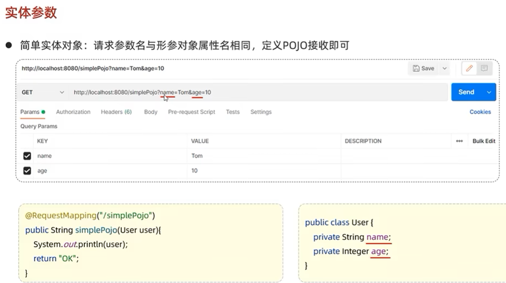
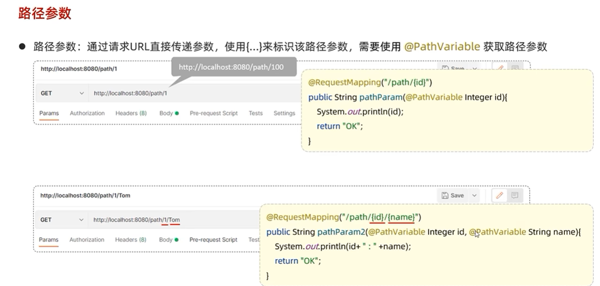

### Java后端开发

##### 1、Java包管理Maven

maven仓库的依赖管理，

```html
https://mvnrepository.com
```


对应的黑马视频：[Day04-01. maven-课程介绍_哔哩哔哩_bilibili](https://www.bilibili.com/video/BV1m84y1w7Tb?vd_source=b0e6d0da66db457c6afda440766d8139&spm_id_from=333.788.videopod.episodes&p=50)


##### 2、如何创建JavaSpring项目？


##### 3、Java Web服务器后端接收参数：


**请求参数接收：**

当要接收的参数很多时，创建对应的实体类；

1、简单实体类创建：



2、复杂实体类创建：


3、接收json数据；

要添加RequestBody;


4、接收路径参数：



RestController注释包括：

1、Controller;

2、Responsebody;


##### 统一响应结果:

Result(code, message, data);


**三层架构**

控制类中不能同时包括：数据访问，逻辑处理，响应数据。

[Day05-09. 分层解耦-三层架构_哔哩哔哩_bilibili](https://www.bilibili.com/video/BV1m84y1w7Tb/?spm_id_from=333.1391.0.0&p=75&vd_source=b0e6d0da66db457c6afda440766d8139)


为什么要增强DAO的灵活性和可扩展性？具体怎么做？

分层这块代码，需要好好理解下。

这个代码需要好好实践下。


**什么是控制反转？**

对象的创建交由容器负责，不需要在类内部处理。具体代码上，只需要在class类声明前，加上如下的关键词：

```java
@Component
public class EmpService implements EmpService{
    
    @Autowired
    private EmpDao empDao;
    ...
}
```

**什么是依赖注入？**

在对象的类成员变量前，加上autowired关键词：

```java
@Componentpublic 
class EmpService implements EmpService{
    @Autowired    
    private EmpDao empDao;    
    ...
}
```


##### 4、MyBatis持久层框架


